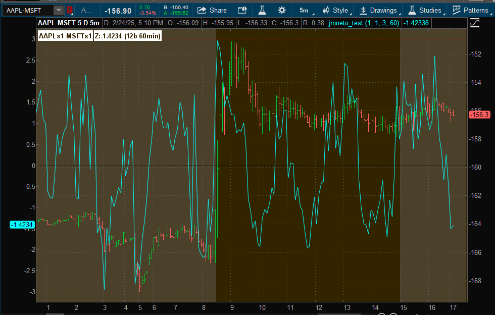
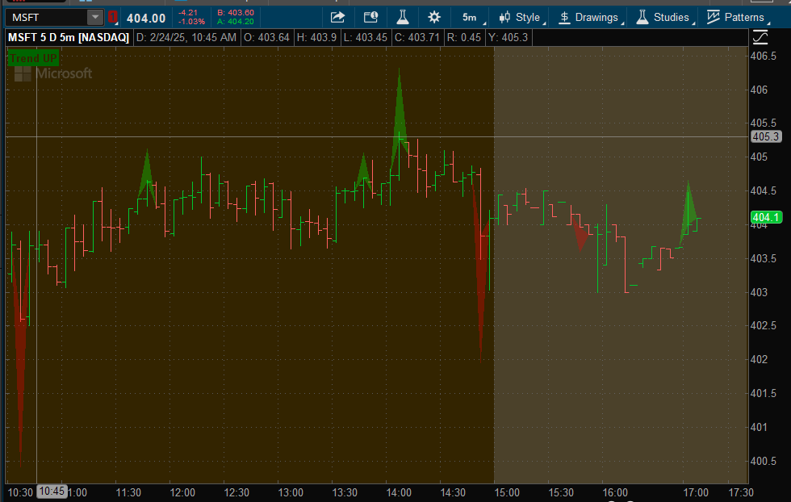
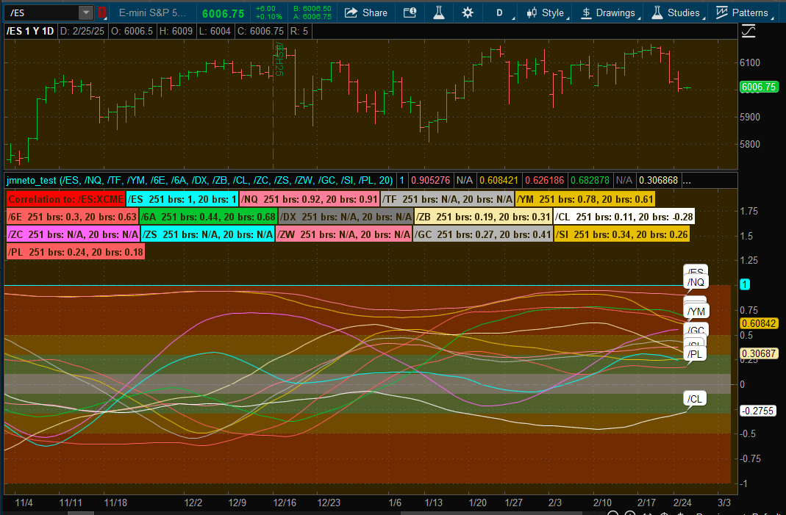
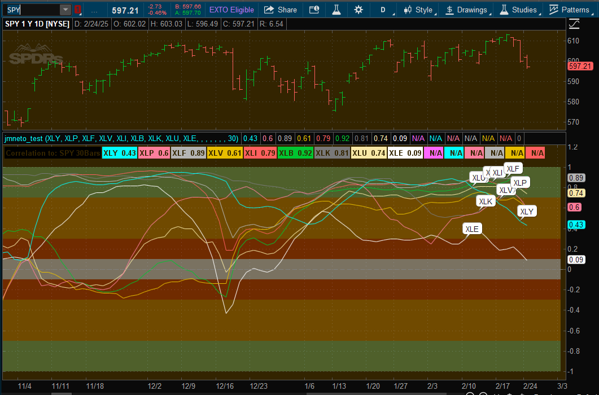
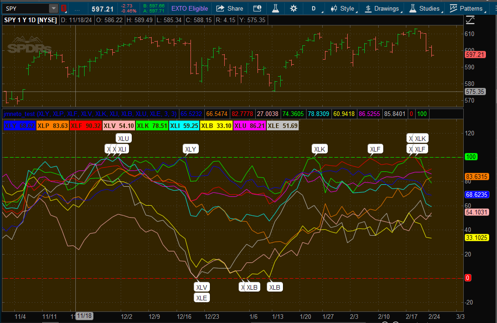

<h1 align="center">
  Custom thinkorswim thinkScript Chart Indicators &  MarketWatch / Scanner Columns
</h1>

<p align="center">
  <a href="https://opensource.org/licenses/MIT">
    
  </a>
</p>

# Navigation

- [**Charts (Indicators)**](./Chart-Scripts.md)  
- [**Columns (MarketWatch or Scanner)**](./Column-Scrits.md) 
- **Advanced Scripts** 
- [**Back to main**](./README.md)

# Contents

- [Pairs Study](#pairs-study)
- [Pairs StudyFutures](#pairs-studyfutures)
- [Breakout Detector Column](#breakout-detector-column)
- [Breakout Detector](#breakout-detector)
- [Correlation Analyzer Study](#correlation-analyzer-study)
- [Correlation Display Study](#correlation-display-study)
- [MultiRank](#multirank)
- [Back to main](./README.md)

### Pairs Study
---

- **Description:**  
  This study analyzes the spread between two financial instruments by calculating the Z-score of their notional spread. It visualizes the Z-score over time, marking significant deviations from the mean to help identify potential pair trading opportunities. The study includes customizable parameters for position sizes, Z-score targets, and the lookback period for Z-score calculation.

- **Purpose:**  
  Designed for traders and analysts engaged in pair trading strategies, this study helps identify when the spread between two correlated instruments deviates significantly from its historical average. By monitoring the Z-score, traders can make informed decisions about entering long or short positions based on statistical anomalies, enhancing the potential for profitable trades while managing risk.

- **Usage:**  
  Ideal for those implementing mean-reversion strategies, the Pairs Study allows users to set specific thresholds for Z-scores to signal potential entry and exit points. By customizing the size of positions and the lookback period, traders can tailor the study to fit different trading styles and timeframes. Visual indicators and labels provide clear signals directly on the chart, facilitating quick decision-making.

    ```
    # Requires /ZC-/ZS format

    declare lower;
    declare once_per_bar;
    declare hide_on_daily;

    # Check assertions for the study
    Assert(GetAggregationPeriod() < AggregationPeriod.DAY , "Study can be calculated only for less than daily periods");

    # Inputs
    ####################################
    
    # trade
    input LeftSideSize = 1;
    input RightSideSize = 1;
    
    # ZScore
    input ZscoreTarget = 3;
    input ZscoreLookbackMinutes = 60;
    
    # cache data
    ####################################
    def LeftSideClose = close(GetSymbolPart(1));
    def RightSideClose = close(GetSymbolPart(2));
    
    # Spread
    ####################################
    def NotionalSpread = (((LeftSideSize * LeftSideClose) / TickSize(GetSymbolPart(1))) * TickValue(GetSymbolPart(1))) - (((RightSideSize * RightSideClose) / TickSize(GetSymbolPart(2))) * TickValue(GetSymbolPart(2)));
    
    # Calculate ZScore
    ####################################
    def ZscoreLookback = Round((ZscoreLookbackMinutes / (GetAggregationPeriod() / 60000)), 0);
    
    plot Zscore = (NotionalSpread[0] - Average(NotionalSpread, ZscoreLookback)) / StDev(NotionalSpread, ZscoreLookback);
    
    plot ZeroMark = 0;
    ZeroMark.SetPaintingStrategy(PaintingStrategy.DASHES);
    ZeroMark.SetLineWeight(1);
    ZeroMark.HideBubble();
    ZeroMark.HideTitle();
    ZeroMark.AssignValueColor(Color.BLACK);
    
    plot ZScoreMarks = if BarNumber() % 2 == 0 then ZscoreTarget  else -ZscoreTarget;
    ZScoreMarks.SetPaintingStrategy(PaintingStrategy.DASHES);
    ZScoreMarks.SetLineWeight(1);
    ZScoreMarks.HideBubble();
    ZScoreMarks.HideTitle();
    ZScoreMarks.AssignValueColor(Color.RED);
    
    # Add Labels
    ####################################
    AddLabel (yes,  GetSymbolPart(1) + "x" + LeftSideSize + " " + GetSymbolPart(2) + "x" + RightSideSize, Color.BLACK);
    
    AddLabel (yes, "Z:" + Zscore + " (" + ZscoreLookback + "b " + ZscoreLookbackMinutes + "min)", if Zscore < -ZscoreTarget or Zscore > ZscoreTarget then Color.VIOLET else Color.BLACK );
    
    AddLabel(Zscore < -ZscoreTarget, "Zscore Long:" + GetSymbolPart(1) + " Short:" + GetSymbolPart(2), Color.DARK_RED );
    
    AddLabel(Zscore > ZscoreTarget, "Zscore Short:" + GetSymbolPart(1) + " Long:" + GetSymbolPart(2), Color.DARK_RED );
    
    # Alerts
    ####################################
    #Alert((Zscore < -ZscoreTarget) or (Zscore > ZscoreTarget), "PairRatio:" + GetSymbol () , Alert.BAR, Sound.Ding);
    ```

**Features:**

- **Notional Spread Calculation:**  
  Computes the spread between two selected symbols based on their respective sizes and current closing prices, adjusted for tick size and value to ensure accurate notional representation.

- **Z-Score Computation:**  
  Calculates the Z-score of the notional spread over a user-defined lookback period. This statistical measure indicates how many standard deviations the current spread is from its historical mean, highlighting significant deviations.

- **Customizable Parameters:**  
  Allows users to set the sizes of each side of the pair, the target Z-score thresholds for signaling, and the lookback period in minutes for Z-score calculation, providing flexibility to suit various trading strategies.

- **Visual Indicators:**  
  Plots the Z-score on the lower chart area with clear markers at the defined Z-score targets. Additionally, a zero line is displayed for reference, and dashed lines indicate the threshold levels, enhancing visual analysis.

- **Dynamic Labels:**  
  Adds informative labels to the chart that display the pair configuration, current Z-score, and potential trading signals (long or short positions) based on the Z-score exceeding predefined targets. Color-coded labels improve readability and prompt attention to significant signals.

- **Alerts (Commented Out):**  
  Includes an option to set up alerts when the Z-score crosses the specified thresholds, notifying traders to potential trading opportunities without manual monitoring.

- **Efficient Performance:**  
  Utilizes assertions and data caching to ensure the study runs efficiently, processing data only for intraday periods and maintaining performance even with extensive datasets.

- **Ease of Integration:**  
  Designed to work seamlessly within the thinkorswim platform, requiring symbols in the /ZC-/ZS format, making it easy to incorporate into existing trading setups and strategies.

Example usage on Chart



### Pairs StudyFutures
---

- **Description:**  
  Implements a pairs trading strategy for futures contracts by calculating the notional spread, ATR-based volatility measures, VWAP with percentage bands, Z-Score normalization, and RSI divergence indicators. This study facilitates the identification of optimal entry and exit points for long and short positions based on statistical and technical signals derived from the relationship between two correlated futures contracts.

- **Purpose:**  
  Provides traders with a comprehensive tool for executing pairs trading strategies in the futures market. By analyzing the notional spread and its statistical properties, the study aids in identifying when two correlated futures contracts deviate from their historical relationship, signaling potential trading opportunities. The inclusion of ATR, VWAP, Z-Score, and RSI divergence enhances the robustness of trade signals, allowing for more informed and precise trading decisions.

- **Usage:**  
  Ideal for traders and quantitative analysts who engage in statistical arbitrage or pairs trading strategies within the futures market. Useful for monitoring the relationship between two correlated futures contracts, determining the appropriate sizing based on notional values, and receiving alerts for potential trading signals based on VWAP breaches, Z-Score thresholds, and RSI divergences. Helps in managing risk and optimizing trade entries and exits by leveraging multiple technical indicators.

    ```
    # Requires /ZC-/ZS format
    
    declare lower;
    declare once_per_bar;
    declare hide_on_daily;
    
    # Check assertions for the study
    Assert(GetAggregationPeriod() < AggregationPeriod.DAY, "Study can be calculated only for less than daily periods");
    
    # Inputs
    ####################################
    # trade
    input LeftSideSize = 1;
    input RightSideSize = 1;
    
    #ATR
    input ATRLengthDays = 14;
    input ATRAverageType = AverageType.WILDERS;
    
    # VWAP Alert
    input VWAPPercentBands = 1.0;
    
    # ZScore
    input ZscoreTarget = 3;
    input ZscoreLookbackMinutes = 60;
    
    # cache data
    ####################################
    def LeftSideClose = close(GetSymbolPart(1));
    def RightSideClose = close(GetSymbolPart(2));
    
    # Calculate Notional Ratio
    ####################################
    def LeftSideNotional = (LeftSideClose / TickSize(GetSymbolPart(1))) * TickValue(GetSymbolPart(1));
    def RightSideNotional = (RightSideClose / TickSize(GetSymbolPart(2))) * TickValue(GetSymbolPart(2));
    def NotionalRatio = LeftSideNotional / RightSideNotional;
    
    # Calculate Notional Spread
    ####################################
    plot NotionalSpread = (LeftSideSize * LeftSideNotional) - (RightSideSize * RightSideNotional);
    NotionalSpread.SetDefaultColor(Color.PINK);
    
    # ATR
    ####################################
    def LeftATRValue = MovingAverage(ATRAverageType, TrueRange(high(GetSymbolPart(1), period = AggregationPeriod.DAY), close(GetSymbolPart(1), period = AggregationPeriod.DAY), low(GetSymbolPart(1), period = AggregationPeriod.DAY)), ATRLengthDays);
    def RightATRValue = MovingAverage(ATRAverageType, TrueRange(high(GetSymbolPart(2), period = AggregationPeriod.DAY), close(GetSymbolPart(2), period = AggregationPeriod.DAY), low(GetSymbolPart(2), period = AggregationPeriod.DAY)), ATRLengthDays);
    
    def LeftATRNotional = (LeftATRValue / LeftSideClose) * LeftSideNotional;
    def RightATRNotional = (RightATRValue / RightSideClose) * RightSideNotional;
    
    # Calculate Delta Beta Weighted
    ####################################
    def BetaLength = 90;
    def BetaReturnLength = 1;
    
    def LeftPairDelta = 1 / TickSize(GetSymbolPart(1)) * TickValue(GetSymbolPart(1));
    def RightPairDelta = 1 / TickSize(GetSymbolPart(2)) * TickValue(GetSymbolPart(2));
    
    def LeftPair = close(GetSymbolPart(1), period = AggregationPeriod.DAY);
    def RightPair = close(GetSymbolPart(2), period = AggregationPeriod.DAY);
    def BetaTo =  LeftPair;
    
    def LeftP = if LeftPair[BetaReturnLength] == 0 then 0 else (LeftPair - LeftPair[BetaReturnLength]) / LeftPair[BetaReturnLength] * 100;
    def RightP = if RightPair[BetaReturnLength] == 0 then 0 else (RightPair - RightPair[BetaReturnLength]) / RightPair[BetaReturnLength] * 100;
    def secondary = if BetaTo[BetaReturnLength] == 0 then 0 else (BetaTo - BetaTo[BetaReturnLength]) / BetaTo[BetaReturnLength] * 100;
    
    def LeftBeta = Covariance(LeftP, secondary, BetaLength) / Sqr(StDev(secondary, BetaLength));
    def RightBeta = Covariance(RightP, secondary, BetaLength) / Sqr(StDev(secondary, BetaLength));
    
    def DeltaBetaWeightLeft = Round(LeftSideSize * LeftPairDelta * LeftPair * 1 / BetaTo  * LeftBeta, 0);
    def DeltaBetaWeightRight = Round(RightSideSize * RightPairDelta * RightPair * 1 / BetaTo * RightBeta, 0);
    
    # Calculate VWAP and % bands
    ####################################
    def periodIndx = GetYYYYMMDD();
    def isPeriodRolled = CompoundValue(1, periodIndx != periodIndx[1], yes);
    
    def volumeSum;
    def volumeVwapSum;
    def volumeVwap2Sum;
    
    if (isPeriodRolled) {
        volumeSum = volume;
        volumeVwapSum = volume * NotionalSpread;
        volumeVwap2Sum = volume * Sqr(NotionalSpread);
    } else {
        volumeSum = CompoundValue(1, volumeSum[1] + volume, volume);
        volumeVwapSum = CompoundValue(1, volumeVwapSum[1] + volume * NotionalSpread, volume * NotionalSpread);
        volumeVwap2Sum = CompoundValue(1, volumeVwap2Sum[1] + volume * Sqr(NotionalSpread), volume * Sqr(NotionalSpread));
    }
    
    plot VWAP = volumeVwapSum / volumeSum;
    VWAP.SetLineWeight(1);
    VWAP.HideBubble();
    VWAP.HideTitle();
    VWAP.SetDefaultColor(GetColor(0));
    
    plot UpperBand = VWAP + AbsValue(VWAP * VWAPPercentBands / 100);
    UpperBand.SetLineWeight(1);
    UpperBand.HideBubble();
    UpperBand.HideTitle();
    UpperBand.SetDefaultColor(GetColor(0));
    
    plot LowerBand = VWAP - AbsValue(VWAP * VWAPPercentBands / 100);
    LowerBand.SetLineWeight(1);
    LowerBand.HideBubble();
    LowerBand.HideTitle();
    LowerBand.SetDefaultColor(GetColor(0));
    
    # Calculate ZScore
    ####################################
    def ZscoreLookback = Round((ZscoreLookbackMinutes / (GetAggregationPeriod() / 60000)), 0);
    def Zscore = (NotionalSpread[0] - Average(NotionalSpread, ZscoreLookback)) / StDev(NotionalSpread, ZscoreLookback);
    
    # RSI Divergence
    ####################################
    def LeftRSI = RSI("price" = close(GetSymbolPart(1)))."RSI";
    def rightRSI = RSI("price" = close(GetSymbolPart(2)))."RSI";
    def RSISpread = LeftRSI - rightRSI;
    def RSIHigh = RSISpread == Highest(RSISpread, ZscoreLookback);
    def RSILow = RSISpread == Lowest(RSISpread, ZscoreLookback);
    
    # Add Labels
    ####################################
    AddLabel (yes,  GetSymbolPart(1) + "x" + LeftSideSize + " " + GetSymbolPart(2) + "x" + RightSideSize, Color.BLACK);
    
    AddLabel (yes, "Z:" + Zscore + " (" + ZscoreLookback + "b " + ZscoreLookbackMinutes + "min)" , if Zscore < -ZscoreTarget or Zscore > ZscoreTarget then Color.VIOLET else Color.BLACK );
    
    AddLabel (yes, "N:" + GetSymbolPart(1) + "x1=" + GetSymbolPart(2) + "x" + AsText(LeftSideNotional / RightSideNotional, NumberFormat.TWO_DECIMAL_PLACES), Color.BLACK);
    
    AddLabel (yes, "V:" + GetSymbolPart(1) + "x1=" + GetSymbolPart(2) + "x" + AsText(LeftATRNotional / RightATRNotional, NumberFormat.TWO_DECIMAL_PLACES), Color.BLACK);
    
    AddLabel(yes, "B:" + GetSymbolPart(1) + ":" + DeltaBetaWeightLeft + " " + GetSymbolPart(2) + ":" + DeltaBetaWeightRight , Color.BLACK);
    
    AddLabel(yes, "TS:" + GetSymbolPart(1) + ":" + TickSize(GetSymbolPart(1)) + " " + GetSymbolPart(2) + ":" +  TickSize(GetSymbolPart(2)) , Color.BLACK);
    
    AddLabel(yes, "TV:" + GetSymbolPart(1) + ":" + TickValue(GetSymbolPart(1)) + " " + GetSymbolPart(2) + ":" +  TickValue(GetSymbolPart(2)) , Color.BLACK);
    
    
    
    # Trade Decision
    AddLabel(NotionalSpread < LowerBand, "VWAP Long:" + GetSymbolPart(1) + " Short:" + GetSymbolPart(2), Color.DARK_RED );
    AddLabel(NotionalSpread > UpperBand, "VWAP Short:" + GetSymbolPart(1) + " Long:" + GetSymbolPart(2), Color.DARK_RED );
    AddLabel(Lowest(Zscore, 5) < -ZscoreTarget, "Zscore Long:" + GetSymbolPart(1) + " Short:" + GetSymbolPart(2), Color.DARK_RED );
    AddLabel(Highest(Zscore, 5) > ZscoreTarget, "Zscore Short:" + GetSymbolPart(1) + " Long:" + GetSymbolPart(2), Color.DARK_RED );
    AddLabel(RSIHigh, "RSI High", Color.DARK_RED);
    AddLabel(RSILow, "RSI Low", Color.DARK_RED);
    
    # Add Alert
    ####################################
    Alert((NotionalSpread < LowerBand or NotionalSpread > UpperBand) and (Lowest(Zscore, 5)  < -ZscoreTarget) or (Highest(Zscore, 5) > ZscoreTarget), "Pair:" + GetSymbol() , Alert.BAR, Sound.Ring);
    
    #Alert(RSIHigh or RSILow, "RSI Alert", Alert.BAR, Sound.Ring);
    ```

**Features:**

- **Notional Spread Calculation:** Determines the difference in notional values between two futures contracts, allowing for balanced position sizing based on contract specifications.
- **ATR-Based Volatility Measures:** Utilizes Average True Range (ATR) to assess the volatility of each side of the pair, aiding in dynamic position sizing and risk management.
- **VWAP with Percentage Bands:** Calculates the Volume Weighted Average Price (VWAP) for the notional spread and establishes upper and lower bands to identify significant deviations.
- **Z-Score Normalization:** Normalizes the notional spread using Z-Score to quantify the extent of deviation from the mean, facilitating standardized trade signals.
- **RSI Divergence Indicators:** Compares Relative Strength Index (RSI) values between the paired contracts to detect divergences, signaling potential reversal or continuation of trends.
- **Delta Beta Weighting:** Applies beta weighting to account for the sensitivity of each contract relative to the paired spread, enhancing the robustness of the strategy.
- **Trade Signal Labels:** Provides visual labels on the chart indicating potential long and short opportunities based on VWAP breaches, Z-Score thresholds, and RSI conditions.
- **Customizable Alerts:** Configures alerts to notify traders when specific trading conditions are met, ensuring timely execution of trading strategies.
- **Comprehensive Labeling:** Displays key metrics such as notional ratios, ATR notional values, tick sizes, and tick values for easy reference and strategy monitoring.

  ### Breakout Detector Column
  ---

- **Description:**  
  Identifies and labels breakout events based on defined consolidation ranges and volume conditions. This study highlights upward and downward breakouts directly on the chart, allowing traders to quickly recognize significant price movements supported by increased trading volume.

- **Purpose:**  
  Helps traders detect potential breakout opportunities by monitoring price movements that exceed established consolidation highs or lows while confirming with volume spikes. Facilitates timely decision-making for entering or exiting trades based on validated breakout signals.

- **Usage:**  
  Ideal for traders employing breakout strategies across various timeframes. Useful for monitoring price consolidation periods and recognizing when price action breaks out of these ranges with strong volume support, enhancing the accuracy of trade entries and exits.

```
# breakout detector column

# Function to determine consolidation ranges
script ConsolidationRange {
    input _length = 1;
    def _window = 1; # this is a constant
    plot hb = fold a = _window to _length with priceH = GetValue(high, _window) do if GetValue(high, a) > priceH then GetValue(high, a) else priceH;
    plot lb = fold b =  _window to _length with priceL = GetValue(low, _window) do if GetValue(low, b) < priceL then GetValue(low, b) else priceL;
}

# Adjust ConsolidationLength depending on aggregation Period
def agp = GetAggregationPeriod();
def ConsolidationLength =
            if agp == AggregationPeriod.FIVE_MIN then 7 else 
            if agp == AggregationPeriod.TEN_MIN then 4 else
            if agp == AggregationPeriod.FIFTEEN_MIN then 3 else
            if agp == AggregationPeriod.HOUR then 4 else
            if agp == AggregationPeriod.DAY then 7 
            else 7;

# Volume check
def VolAvg = Average(volume, ConsolidationLength );
def VolCheck = volume > VolAvg;

# Get Breakout Limits
def crup = ConsolidationRange(ConsolidationLength).hb;
def crdn = ConsolidationRange(ConsolidationLength).lb;

# Check for breakout
def breakup = if crup < close then 1 else 0;
def breakdn = if crdn > close then 1 else 0;
def bup = breakup == 1 and VolCheck;
def bdn = breakdn == 1 and VolCheck;

# Add Breakout Label
AddLabel(yes,            if bup then "Breakout UP"
                    else if bdn then "Breakout DOWN"
                    else " "
, 
                         if bup then Color.DARK_GREEN
                    else if bdn then Color.RED
                    else Color.GRAY
);
```


**Features:**

- **Consolidation Range Calculation:**  
  Determines the highest high and lowest low over a specified consolidation period, adapting to different chart timeframes to accurately define consolidation zones.

- **Adaptive Consolidation Length:**  
  Dynamically adjusts the length of the consolidation period based on the chart's aggregation interval (e.g., 5-minute, 10-minute, hourly, daily), ensuring relevant breakout detection across various timeframes.

- **Volume Confirmation:**  
  Incorporates a volume check by comparing current volume to the average volume over the consolidation period, ensuring that breakouts are supported by significant trading activity for higher reliability.

- **Breakout Identification:**  
  Detects upward and downward breakouts by comparing the closing price to the consolidation high and low levels, respectively, and validates these breakouts with the volume condition.

- **Visual Breakout Labels:**  
  Adds clear, color-coded labels ("Breakout UP" in dark green and "Breakout DOWN" in red) to the chart, providing immediate visual indicators of breakout events for quick decision-making.

- **Customizable Parameters:**  
  Allows modification of the consolidation length and other inputs to tailor the breakout detection mechanism to individual trading strategies and preferences.

  ### Breakout Detector
  ---

- **Description:**  
  Identifies and visualizes breakout events in price movements by analyzing consolidation ranges, volume surges, and trend confirmations. This study highlights potential upward and downward breakouts, providing clear visual cues and alerts to assist traders in making informed decisions.

- **Purpose:**  
  Helps traders detect significant price breakouts from consolidation periods, ensuring that breakouts are supported by increased volume and trend direction. By confirming breakouts with volume and trend analysis, the detector reduces false signals and enhances the reliability of trading signals.

- **Usage:**  
  Ideal for traders looking to capitalize on momentum by entering positions during confirmed breakout events. Useful for identifying entry and exit points in trending markets, managing risk by avoiding false breakouts, and enhancing trade timing through visual and alert-based signals.

```

input Alert = yes;
input CheckVolume = yes;
input TrendCheckBars = 3;

# Function to determine consolidation ranges
script ConsolidationRange {
    input _length = 1;
    def _window = 1; # this is a constant
    plot hb = fold a = _window to _length with _priceH = GetValue(high, _window) do if GetValue(high, a) > _priceH then GetValue(high, a) else _priceH;
    plot lb = fold b = _window to _length with _priceL = GetValue(low, _window) do if GetValue(low, b) < _priceL then GetValue(low, b) else _priceL;
}

# Adjust ConsolidationLength depending on aggregation Period
def _agp = GetAggregationPeriod();
def _ConsolidationLength =
            if _agp == AggregationPeriod.MIN then 30 else 
            if _agp == AggregationPeriod.FIVE_MIN then 7 else 
            if _agp == AggregationPeriod.TEN_MIN then 4 else
            if _agp == AggregationPeriod.FIFTEEN_MIN then 3 else
            if _agp == AggregationPeriod.HOUR then 4 else
            if _agp == AggregationPeriod.DAY then 7 
            else 7;

# Volume check
def _VolAvg = Average(volume, _ConsolidationLength );
def _VolCheck = volume > _VolAvg;
AddLabel(_VolCheck, "Volume UP", Color.ORANGE);

# Get Breakout Limits
def _crup = ConsolidationRange(_ConsolidationLength).hb;
def _crdn = ConsolidationRange(_ConsolidationLength).lb;

# Check for breakout
def _bup = _crup < close and if CheckVolume then _VolCheck else 1;
def _bdn = _crdn > close and if CheckVolume then _VolCheck else 1;

# Add breakout marks
# We show the direction of the breakout plus the strength
def _at = AbsValue(close() - close()[1]) * 2;  # x 2 to make more visible
def _cld = if _bup then close + _at else if _bdn then close - _at else close;
AddCloud(_cld, close, Color.GREEN, Color.RED);

# Add Breakout Label
AddLabel(_bup, "Breakout UP", Color.DARK_GREEN);
AddLabel(_bdn, "Breakout DOWN", Color.RED);

# Function to determine trends
script TrendCheck {
    input _length = 1;
    def _window = 1; # this is a constant
    plot dnt = fold a = _window to _length with dntaux = 1 do if GetValue(high, a) < GetValue(high, a + 1) then dntaux else 0;
    plot upt = fold b = _window to _length with uptaux = 1 do if GetValue(low, b) > GetValue(low, b + 1) then uptaux else 0;
}

# Check for Trend 
def _upt = TrendCheck(TrendCheckBars).upt and open() < close();
def _dnt = TrendCheck(TrendCheckBars).dnt and open() > close();

# Add Trend Label
AddLabel(_upt, "Trend UP", Color.DARK_GREEN);
AddLabel(_dnt, "Trend DOWN", Color.RED);

# Add Alert if set to (only alert after previous bar has finished printing confirming the breakout)
Alert(Alert and _bup , "Breakout UP: " + GetSymbol() , Alert.BAR, Sound.Ding);
Alert(Alert and _bdn , "Breakout DOWN: " + GetSymbol() , Alert.BAR, Sound.Ding);
```

**Features:**

- **Consolidation Range Detection:** Identifies the highest and lowest price levels over a specified consolidation period, determining potential breakout thresholds.
  
- **Dynamic Consolidation Length:** Automatically adjusts the consolidation length based on the chart's aggregation period to maintain relevance across different time frames.
  
- **Volume Analysis:** Incorporates volume checks to ensure that breakouts are accompanied by higher-than-average trading volume, enhancing the reliability of signals.
  
- **Breakout Indicators:** Utilizes cloud visuals and labels to clearly display the direction and strength of breakouts, making it easy to spot potential trading opportunities.
  
- **Trend Confirmation:** Analyzes recent price trends to confirm the direction of the breakout, reducing false signals by ensuring that breakouts align with prevailing market trends.
  
- **Customizable Alerts:** Provides audible and visual alerts for breakout events, allowing traders to stay informed in real-time without constantly monitoring the chart.
  
- **User-Friendly Labels:** Adds informative labels for volume increases, breakout directions, and trend confirmations, facilitating quick and intuitive chart interpretation.
  
- **Optimized Performance:** Engineered for efficiency with code optimizations and reviews, ensuring smooth performance even on charts with extensive data.

Example usage on Chart



### Correlation Analyzer Study
---

- **Description:**  
  Calculates and visualizes the correlation of the primary chart symbol with a set of predefined important symbols. It displays both the average correlation over a specified length and the total average correlation across all bars. The study includes labels and chart bubbles for quick reference and uses color-coded clouds to represent different correlation strength levels.

- **Purpose:**  
  Provides traders and analysts with a comprehensive view of how the primary symbol correlates with key market instruments. By monitoring these correlations, users can identify potential market trends, diversification opportunities, and risk management insights based on the relationships between different assets.

- **Usage:**  
  Ideal for traders managing multi-asset portfolios or those interested in inter-market analysis. Useful for assessing the strength and consistency of correlations over time, making informed decisions on asset allocation, hedging strategies, and identifying potential trading opportunities based on correlated movements.

```
# Calculates and displays correlations to most import names
# Calculates average for a determined lenght and total bars

declare once_per_bar;

# Symbols to correlate
input Symbol1  = "/ES";
input Symbol2  = "/NQ";
input Symbol3  = "/TF";
input Symbol4  = "/YM";
input Symbol5  = "/6E";
input Symbol6  = "/6A";
input Symbol7  = "/DX";
input Symbol8  = "/ZB";
input Symbol9  = "/CL";
input Symbol10  = "/ZC";
input Symbol11 = "/ZS";
input Symbol12 = "/ZW";
input Symbol13 = "/GC";
input Symbol14 = "/SI";
input Symbol15 = "/PL";

# Number of bars for short time average
input length = 20;

# Define declarations for the study
declare lower ;

# Check assertion for the study
def ap = GetAggregationPeriod();
Assert(ap == AggregationPeriod.DAY  , "Study can only be calculated for daily time-aggregated charts");

# Calculate Correlation Function
script PrintCorrelation {
    input _symbol = "SPY";
    input _length = 20 ;
    def _maxBars = HighestAll(if IsNaN(close(period = AggregationPeriod.DAY)) then 0 else BarNumber());
    def _Correlation = Correlation(close(), close(_symbol), _length);
    plot CorrelationAvg = Average(_Correlation, _length);
    plot CorrelationTotalAvg = TotalSum(_Correlation) / _maxBars;
}

def _showBuble = BarNumber() == HighestAll(if IsNaN(close(period = AggregationPeriod.DAY)) then 0 else BarNumber());

#Plot Correlation Symbol
AddLabel(yes, "Correlation to: " + GetSymbol() , Color.RED);

# Plot Results
plot C1 = PrintCorrelation ( Symbol1, length).CorrelationAvg;
AddLabel(yes, PrintCorrelation ( Symbol1, length).Symbol + "  " + PrintCorrelation ( Symbol1, length).maxBars + " brs: " + Round(PrintCorrelation ( Symbol1, length).CorrelationTotalAvg , 2) + ", " + PrintCorrelation ( Symbol1, length).length + " brs: " + Round(PrintCorrelation ( Symbol1, length).CorrelationAvg, 2) , C1.TakeValueColor() );
AddChartBubble( _showBuble, C1, PrintCorrelation ( Symbol1, length).Symbol, Color.WHITE);

plot C2 = PrintCorrelation ( Symbol2, length).CorrelationAvg;
AddLabel(yes, PrintCorrelation ( Symbol2, length).Symbol + "  " + PrintCorrelation ( Symbol2, length).maxBars + " brs: " + Round(PrintCorrelation ( Symbol2, length).CorrelationTotalAvg , 2) + ", " + PrintCorrelation ( Symbol2, length).length + " brs: " + Round(PrintCorrelation ( Symbol2, length).CorrelationAvg, 2) , C2.TakeValueColor() );
AddChartBubble( _showBuble, C2, PrintCorrelation ( Symbol2, length).Symbol, Color.WHITE);

plot C3 = PrintCorrelation ( Symbol3, length).CorrelationAvg;
AddLabel(yes, PrintCorrelation ( Symbol3, length).Symbol + "  " + PrintCorrelation ( Symbol3, length).maxBars + " brs: " + Round(PrintCorrelation ( Symbol3, length).CorrelationTotalAvg , 2) + ", " + PrintCorrelation ( Symbol3, length).length + " brs: " + Round(PrintCorrelation ( Symbol3, length).CorrelationAvg, 2) , C3.TakeValueColor() );
AddChartBubble( _showBuble, C3, PrintCorrelation ( Symbol3, length).Symbol, Color.WHITE);

plot C4 = PrintCorrelation ( Symbol4, length).CorrelationAvg;
AddLabel(yes, PrintCorrelation ( Symbol4, length).Symbol + "  " + PrintCorrelation ( Symbol4, length).maxBars + " brs: " + Round(PrintCorrelation ( Symbol4, length).CorrelationTotalAvg , 2) + ", " + PrintCorrelation ( Symbol4, length).length + " brs: " + Round(PrintCorrelation ( Symbol4, length).CorrelationAvg, 2) , C4.TakeValueColor() );
AddChartBubble( _showBuble, C4, PrintCorrelation ( Symbol4, length).Symbol, Color.WHITE);

plot C5 = PrintCorrelation ( Symbol5, length).CorrelationAvg;
AddLabel(yes, PrintCorrelation ( Symbol5, length).Symbol + "  " + PrintCorrelation ( Symbol5, length).maxBars + " brs: " + Round(PrintCorrelation ( Symbol5, length).CorrelationTotalAvg , 2) + ", " + PrintCorrelation ( Symbol5, length).length + " brs: " + Round(PrintCorrelation ( Symbol5, length).CorrelationAvg, 2) , C5.TakeValueColor() );
AddChartBubble( _showBuble, C5, PrintCorrelation ( Symbol5, length).Symbol, Color.WHITE);

plot C6 = PrintCorrelation ( Symbol6, length).CorrelationAvg;
AddLabel(yes, PrintCorrelation ( Symbol6, length).Symbol + "  " + PrintCorrelation ( Symbol6, length).maxBars + " brs: " + Round(PrintCorrelation ( Symbol6, length).CorrelationTotalAvg , 2) + ", " + PrintCorrelation ( Symbol6, length).length + " brs: " + 
Round(PrintCorrelation ( Symbol6, length).CorrelationAvg, 2) , C6.TakeValueColor() );
AddChartBubble( _showBuble, C6, PrintCorrelation ( Symbol6, length).Symbol, Color.WHITE);

plot C7 = PrintCorrelation ( Symbol7, length).CorrelationAvg;
AddLabel(yes, PrintCorrelation ( Symbol7, length).Symbol + "  " + PrintCorrelation ( Symbol7, length).maxBars + " brs: " + Round(PrintCorrelation ( Symbol7, length).CorrelationTotalAvg , 2) + ", " + PrintCorrelation ( Symbol7, length).length + " brs: " + Round(PrintCorrelation ( Symbol7, length).CorrelationAvg, 2) , C7.TakeValueColor() );
AddChartBubble( _showBuble, C7, PrintCorrelation ( Symbol7, length).Symbol, Color.WHITE);

plot C8 = PrintCorrelation ( Symbol8, length).CorrelationAvg;
AddLabel(yes, PrintCorrelation ( Symbol8, length).Symbol + "  " + PrintCorrelation ( Symbol8, length).maxBars + " brs: " + Round(PrintCorrelation ( Symbol8, length).CorrelationTotalAvg , 2) + ", " + PrintCorrelation ( Symbol8, length).length + " brs: " + Round(PrintCorrelation ( Symbol8, length).CorrelationAvg, 2) , C8.TakeValueColor() );
AddChartBubble( _showBuble, C8, PrintCorrelation ( Symbol8, length).Symbol, Color.WHITE);

plot C9 = PrintCorrelation ( Symbol9, length).CorrelationAvg;
AddLabel(yes, PrintCorrelation ( Symbol9, length).Symbol + "  " + PrintCorrelation ( Symbol9, length).maxBars + " brs: " + Round(PrintCorrelation ( Symbol9, length).CorrelationTotalAvg , 2) + ", " + PrintCorrelation ( Symbol9, length).length + " brs: " + Round(PrintCorrelation ( Symbol9, length).CorrelationAvg, 2) , C9.TakeValueColor() );
AddChartBubble( _showBuble, C9, PrintCorrelation ( Symbol9, length).Symbol, Color.WHITE);

plot C10 = PrintCorrelation ( Symbol10, length).CorrelationAvg;
AddLabel(yes, PrintCorrelation ( Symbol10, length).Symbol + "  " + PrintCorrelation ( Symbol10, length).maxBars + " brs: " + Round(PrintCorrelation ( Symbol10, length).CorrelationTotalAvg , 2) + ", " + PrintCorrelation ( Symbol10, length).length + " brs: " + Round(PrintCorrelation ( Symbol10, length).CorrelationAvg, 2) , C10.TakeValueColor() );
AddChartBubble( _showBuble, C10, PrintCorrelation ( Symbol10, length).Symbol, Color.WHITE);

plot C11 = PrintCorrelation ( Symbol11, length).CorrelationAvg;
AddLabel(yes, PrintCorrelation ( Symbol11, length).Symbol + "  " + PrintCorrelation ( Symbol11, length).maxBars + " brs: " + Round(PrintCorrelation ( Symbol11, length).CorrelationTotalAvg , 2) + ", " + PrintCorrelation ( Symbol11, length).length + " brs: " + Round(PrintCorrelation ( Symbol11, length).CorrelationAvg, 2) , C11.TakeValueColor() );
AddChartBubble( _showBuble, C11, PrintCorrelation ( Symbol11, length).Symbol, Color.WHITE);

plot C12 = PrintCorrelation ( Symbol12, length).CorrelationAvg;
AddLabel(yes, PrintCorrelation ( Symbol12, length).Symbol + "  " + PrintCorrelation ( Symbol12, length).maxBars + " brs: " + Round(PrintCorrelation ( Symbol12, length).CorrelationTotalAvg , 2) + ", " + PrintCorrelation ( Symbol12, length).length + " brs: " + Round(PrintCorrelation ( Symbol12, length).CorrelationAvg, 2) , C12.TakeValueColor() );
AddChartBubble( _showBuble, C12, PrintCorrelation ( Symbol12, length).Symbol, Color.WHITE);

plot C13 = PrintCorrelation ( Symbol13, length).CorrelationAvg;
AddLabel(yes, PrintCorrelation ( Symbol13, length).Symbol + "  " + PrintCorrelation ( Symbol13, length).maxBars + " brs: " + Round(PrintCorrelation ( Symbol13, length).CorrelationTotalAvg , 2) + ", " + PrintCorrelation ( Symbol13, length).length + " brs: " + Round(PrintCorrelation ( Symbol13, length).CorrelationAvg, 2) , C13.TakeValueColor() );
AddChartBubble( _showBuble, C13, PrintCorrelation ( Symbol13, length).Symbol, Color.WHITE);

plot C14 = PrintCorrelation ( Symbol14, length).CorrelationAvg;
AddLabel(yes, PrintCorrelation ( Symbol14, length).Symbol + "  " + PrintCorrelation ( Symbol14, length).maxBars + " brs: " + Round(PrintCorrelation ( Symbol14, length).CorrelationTotalAvg , 2) + ", " + PrintCorrelation ( Symbol14, length).length + " brs: " + Round(PrintCorrelation ( Symbol14, length).CorrelationAvg, 2) , C14.TakeValueColor() );
AddChartBubble( _showBuble, C14, PrintCorrelation ( Symbol14, length).Symbol, Color.WHITE);

plot C15 = PrintCorrelation ( Symbol15, length).CorrelationAvg;
AddLabel(yes, PrintCorrelation ( Symbol15, length).Symbol + "  " + PrintCorrelation ( Symbol15, length).maxBars + " brs: " + Round(PrintCorrelation ( Symbol15, length).CorrelationTotalAvg , 2) + ", " + PrintCorrelation ( Symbol15, length).length + " brs: " + Round(PrintCorrelation ( Symbol15, length).CorrelationAvg, 2) , C15.TakeValueColor() );
AddChartBubble( _showBuble, C15, PrintCorrelation ( Symbol15, length).Symbol, Color.WHITE);

AddCloud(.5, 1, Color.LIGHT_RED, Color.LIGHT_RED);
AddCloud(.3, .5, Color.LIGHT_ORANGE, Color.LIGHT_ORANGE);
AddCloud(.1, .3, Color.LIGHT_GREEN, Color.LIGHT_GREEN);
AddCloud(.1, -.1, Color.LIGHT_GRAY, Color.LIGHT_GRAY);
AddCloud(.1, -.1, Color.LIGHT_GRAY, Color.LIGHT_GRAY);
AddCloud(-.1, -.3, Color.LIGHT_GREEN, Color.LIGHT_GREEN);
AddCloud(-.3, -.5, Color.LIGHT_ORANGE, Color.LIGHT_ORANGE);
AddCloud(-.5, -1, Color.LIGHT_RED, Color.LIGHT_RED);

#Plot control lines
plot ZeroLine = 0;
ZeroLine.AssignValueColor(Color.GRAY);
ZeroLine.SetPaintingStrategy(PaintingStrategy.DASHES);
ZeroLine.HideBubble();
```

**Features:**

- **Multi-Symbol Correlation Calculation:** Analyzes and displays correlations between the primary chart symbol and up to 15 predefined important symbols.
- **Average Correlation Metrics:** Provides both the average correlation over a user-defined length and the total average across all bars for comprehensive insight.
- **Visual Labels and Bubbles:** Adds informative labels and chart bubbles to highlight correlation values and associated symbols for easy interpretation.
- **Color-Coded Correlation Clouds:** Utilizes colored clouds to represent different levels of correlation strength, enhancing visual analysis.
- **Daily Time Aggregation:** Designed to work specifically with daily time-aggregated charts, ensuring consistency and accuracy in correlation calculations.
- **Customizable Inputs:** Allows users to modify the symbols and the length of the correlation calculation period to fit their specific analysis needs.

Example usage on Chart



### Correlation Display Study
---

- **Description:**  
  Calculates and displays the correlation of the selected security to up to fifteen key symbols (primarily sector ETFs) over a specified number of daily bars. This study visualizes how closely the price movements of the current symbol align with those of the chosen benchmark symbols, aiding in the analysis of market relationships and sector strength.

- **Purpose:**  
  Provides traders and analysts with a comprehensive view of how the current security correlates with major market sectors or specific benchmarks. By understanding these correlations, users can make more informed decisions regarding portfolio diversification, sector rotation, and risk management based on the strength and direction of these relationships.

- **Usage:**  
  Ideal for investors and traders seeking to assess the relationship between a particular security and key market sectors or benchmarks. Useful for identifying leading or lagging sectors, enhancing portfolio diversification strategies, and gauging the overall market sentiment relative to selected indicators.

```
# Calculates and displays correlations to most important names
# Calculates average for a determined length and total bars

# Define declarations for the study
declare lower ;
declare once_per_bar;

# Symbols
input Symbol1  = "XLY";
input Symbol2  = "XLP";
input Symbol3  = "XLF";
input Symbol4  = "XLV";
input Symbol5  = "XLI";
input Symbol6  = "XLB";
input Symbol7  = "XLK";
input Symbol8  = "XLU";
input Symbol9  = "XLE";
input Symbol10 = "";
input Symbol11 = "";
input Symbol12 = "";
input Symbol13 = "";
input Symbol14 = "";
input Symbol15 = "";

# Number of bars 
input length = 30;

# Check assertion for the study
Assert(GetAggregationPeriod() == AggregationPeriod.DAY  , "Study can only be calculated for daily time-aggregated charts");

# Calculate Correlation Function
script PrintCorrelation {
    input _symbol = "SPY";
    input _length = 20 ;
    plot Correlation = Round(Correlation(close(), close(_symbol), _length), 2);
}

def maxBars = HighestAll(if IsNaN(close()) then 0 else BarNumber());

# Plot Correlation Symbol
AddLabel(yes, "Correlation to: " + GetSymbol() + " " + length + "Bars" , Color.BLACK);

# Plot Results
plot C1 = PrintCorrelation ( Symbol1, length).Correlation;
AddLabel(yes, PrintCorrelation ( Symbol1, length).Symbol + "  " + PrintCorrelation ( Symbol1, length).Correlation , C1.TakeValueColor() );
AddChartBubble( BarNumber() == maxBars - 1, C1, PrintCorrelation ( Symbol1, length).Symbol, Color.WHITE);

plot C2 = PrintCorrelation ( Symbol2, length).Correlation;
AddLabel(yes, PrintCorrelation ( Symbol2, length).Symbol + "  " + PrintCorrelation ( Symbol2, length).Correlation , C2.TakeValueColor() );
AddChartBubble( BarNumber() == maxBars - 2, C2, PrintCorrelation ( Symbol2, length).Symbol, Color.WHITE);

plot C3 = PrintCorrelation ( Symbol3, length).Correlation;
AddLabel(yes, PrintCorrelation ( Symbol3, length).Symbol + "  " + PrintCorrelation ( Symbol3, length).Correlation , C3.TakeValueColor() );
AddChartBubble( BarNumber() == maxBars - 3, C3, PrintCorrelation ( Symbol3, length).Symbol, Color.WHITE);

plot C4 = PrintCorrelation ( Symbol4, length).Correlation;
AddLabel(yes, PrintCorrelation ( Symbol4, length).Symbol + "  " + PrintCorrelation ( Symbol4, length).Correlation , C4.TakeValueColor() );
AddChartBubble( BarNumber() == maxBars - 4, C4, PrintCorrelation ( Symbol4, length).Symbol, Color.WHITE);

plot C5 = PrintCorrelation ( Symbol5, length).Correlation;
AddLabel(yes, PrintCorrelation ( Symbol5, length).Symbol + "  " + PrintCorrelation ( Symbol5, length).Correlation , C5.TakeValueColor() );
AddChartBubble( BarNumber() == maxBars - 5, C5, PrintCorrelation ( Symbol5, length).Symbol, Color.WHITE);

plot C6 = PrintCorrelation ( Symbol6, length).Correlation;
AddLabel(yes, PrintCorrelation ( Symbol6, length).Symbol + "  " + PrintCorrelation ( Symbol6, length).Correlation , C6.TakeValueColor() );
AddChartBubble( BarNumber() == maxBars - 6 , C6, PrintCorrelation ( Symbol6, length).Symbol, Color.WHITE);

plot C7 = PrintCorrelation ( Symbol7, length).Correlation;
AddLabel(yes, PrintCorrelation ( Symbol7, length).Symbol + "  " + PrintCorrelation ( Symbol7, length).Correlation , C7.TakeValueColor() );
AddChartBubble( BarNumber() == maxBars - 7, C7, PrintCorrelation ( Symbol7, length).Symbol, Color.WHITE);

plot C8 = PrintCorrelation ( Symbol8, length).Correlation;
AddLabel(yes, PrintCorrelation ( Symbol8, length).Symbol + "  " + PrintCorrelation ( Symbol8, length).Correlation , C8.TakeValueColor() );
AddChartBubble( BarNumber() == maxBars - 8, C8, PrintCorrelation ( Symbol8, length).Symbol, Color.WHITE);

plot C9 = PrintCorrelation ( Symbol9, length).Correlation;
AddLabel(yes, PrintCorrelation ( Symbol9, length).Symbol + "  " + PrintCorrelation ( Symbol9, length).Correlation , C9.TakeValueColor() );
AddChartBubble( BarNumber() == maxBars - 9, C9, PrintCorrelation ( Symbol9, length).Symbol, Color.WHITE);

plot C10 = PrintCorrelation ( Symbol10, length).Correlation;
AddLabel(yes, PrintCorrelation ( Symbol10, length).Symbol + "  "  + PrintCorrelation ( Symbol10, length).Correlation , C10.TakeValueColor() );
AddChartBubble( BarNumber() == maxBars - 10, C10, PrintCorrelation ( Symbol10, length).Symbol, Color.WHITE);

plot C11 = PrintCorrelation ( Symbol11, length).Correlation;
AddLabel(yes, PrintCorrelation ( Symbol11, length).Symbol + "  " + PrintCorrelation ( Symbol11, length).Correlation , C11.TakeValueColor() );
AddChartBubble( BarNumber() == maxBars - 11, C11, PrintCorrelation ( Symbol11, length).Symbol, Color.WHITE);

plot C12 = PrintCorrelation ( Symbol12, length).Correlation;
AddLabel(yes, PrintCorrelation ( Symbol12, length).Symbol + "  " + PrintCorrelation ( Symbol12, length).Correlation , C12.TakeValueColor() );
AddChartBubble( BarNumber() == maxBars - 12, C12, PrintCorrelation ( Symbol12, length).Symbol, Color.WHITE);

plot C13 = PrintCorrelation ( Symbol13, length).Correlation;
AddLabel(yes, PrintCorrelation ( Symbol13, length).Symbol + "  " + PrintCorrelation ( Symbol13, length).Correlation , C13.TakeValueColor() );
AddChartBubble( BarNumber() == maxBars - 13, C13, PrintCorrelation ( Symbol13, length).Symbol, Color.WHITE);

plot C14 = PrintCorrelation ( Symbol14, length).Correlation;
AddLabel(yes, PrintCorrelation ( Symbol14, length).Symbol + "  " + PrintCorrelation ( Symbol14, length).Correlation , C14.TakeValueColor() );
AddChartBubble( BarNumber() == maxBars - 14, C14, PrintCorrelation ( Symbol14, length).Symbol, Color.WHITE);

plot C15 = PrintCorrelation ( Symbol15, length).Correlation;
AddLabel(yes, PrintCorrelation ( Symbol15, length).Symbol + "  " + PrintCorrelation ( Symbol15, length).Correlation , C15.TakeValueColor() );
AddChartBubble( BarNumber() == maxBars - 15, C15, PrintCorrelation ( Symbol15, length).Symbol, Color.WHITE);

AddCloud(.7, 1, Color.LIGHT_GREEN, Color.LIGHT_GREEN);
AddCloud(.3, .7, Color.LIGHT_ORANGE, Color.LIGHT_ORANGE);
AddCloud(.1, .3, Color.LIGHT_RED, Color.LIGHT_RED);
AddCloud(.1, -.1, Color.LIGHT_GRAY, Color.LIGHT_GRAY);
AddCloud(.1, -.1, Color.LIGHT_GRAY, Color.LIGHT_GRAY);
AddCloud(-.1, -.3, Color.LIGHT_RED, Color.LIGHT_RED);
AddCloud(-.3, -.7, Color.LIGHT_ORANGE, Color.LIGHT_ORANGE);
AddCloud(-.7, -1, Color.LIGHT_GREEN, Color.LIGHT_GREEN);

# Plot control lines
plot ZeroLine = 0;
ZeroLine.AssignValueColor(Color.GRAY);
ZeroLine.SetPaintingStrategy(PaintingStrategy.DASHES);
ZeroLine.HideBubble();
```

**Features:**

- **Multi-Symbol Correlation Calculation:** Computes the correlation between the current security and up to fifteen predefined symbols, allowing for broad and detailed market relationship analysis.
- **Customizable Parameters:** Users can adjust the symbols and the length (number of bars) over which the correlation is calculated to fit their specific analytical needs.
- **Visual Indicators:** Utilizes colored clouds to represent different correlation ranges, enhancing the visual interpretation of correlation strengths and directions.
- **Dynamic Labels and Bubbles:** Displays real-time correlation values and associated symbols directly on the chart, providing immediate insights without cluttering the visual space.
- **Controlled Aggregation Period:** Ensures that the study is applied only to daily time-aggregated charts, maintaining consistency and accuracy in correlation calculations.
- **Zero Line Reference:** Includes a dashed zero line to easily identify positive and negative correlations, aiding in quick perceptual assessments.

Example usage on Chart



### MultiRank

- **Description:**  
  Computes and visualizes the rank of multiple selected symbols within their historical price range. This lower study ranks each symbol based on their current closing price relative to their highest and lowest prices over the entire dataset. It also highlights compression events and marks extreme rank values with chart bubbles for easy identification.

- **Purpose:**  
  Helps traders assess the relative strength or weakness of a set of symbols by ranking their current price positions within historical ranges. By identifying compression tops and bottoms, the script aids in spotting potential breakout or reversal opportunities, enhancing decision-making for entry and exit points.

- **Usage:**  
  Ideal for traders and analysts monitoring multiple sectors or assets simultaneously. Useful for comparing the performance of different ETFs, sectors, or stocks, and for identifying when a particular symbol is reaching extreme high or low ranks. The compression alerts and chart bubbles provide visual cues for significant market movements.

- **Features:**
  
  - **Multi-Symbol Ranking:**  
    Calculates the rank for nine different symbols, allowing for comprehensive comparison across multiple assets.
  
  - **Customizable Symbols:**  
    Users can specify up to nine symbols (`Symbol1` to `Symbol9`) to be ranked, providing flexibility to focus on preferred assets.
  
  - **Value Function Calculation:**  
    Determines the rank based on the formula `(100 * (current price - lowest price)) / (highest price - lowest price)`, scaling the rank between 0 and 100.
  
  - **Color-Coded Plots:**  
    Each symbol's rank is plotted with a distinct color for easy differentiation and visual analysis.
  
  - **Compression Alerts:**  
    Detects and alerts when a specified number of symbols experience compression at the top (rank > 99) or bottom (rank < 1) within a defined number of bars.
  
  - **Vertical Lines and Alerts:**  
    Adds dashed vertical lines on the chart to indicate compression events and triggers audible alerts to notify the user.
  
  - **Chart Bubbles:**  
    Places bubbles on the chart when a symbol's rank reaches extreme values (below 1 or above 99), highlighting significant market conditions.
  
  - **Visual Markers:**  
    Plots horizontal lines at ranks 0 and 100 to define the range boundaries, enhancing the readability of rank movements.
  
  - **Customization Options:**  
    Allows users to adjust the number of bars considered for compression detection (`compressionbars`) and the number of symbols required to trigger a compression alert (`compressionSymbols`).

```
declare lower;

# Symbols
# #############################################################
input Symbol1 = "XLY";
input Symbol2 = "XLP";
input Symbol3 = "XLF";
input Symbol4 = "XLV";
input Symbol5 = "XLK";
input Symbol6 = "XLI";
input Symbol7 = "XLB";
input Symbol8 = "XLU";
input Symbol9 = "XLE";

# Calculate Value Function
# #############################################################
script PrintRank {
    input _symbol = "SPY";
    def c = close(_symbol);
    #def c = CompoundValue(1, close(_symbol), Double.NaN);
    def Hi = HighestAll(c) ;        # highest over range
    def Lo = LowestAll(c) ;         # lowest over range

    plot Value = (100 * (c - Lo)) / (Hi - Lo);  # rank
    #plot Value = Average((100 * (c - Lo)) / (Hi - Lo), 5);  # rank
}

# Plot Results
# #############################################################
plot C1 = PrintRank(Symbol1).Value;
C1.AssignValueColor(Color.BLUE);
AddLabel(yes, Symbol1 + "  " + AsText(C1, NumberFormat.TWO_DECIMAL_PLACES ) , C1.TakeValueColor());
C1.SetLineWeight(1);

plot C2 = PrintRank(Symbol2).Value;
C2.AssignValueColor(Color.DARK_ORANGE);
AddLabel(yes, Symbol2 + "  " + AsText(C2, NumberFormat.TWO_DECIMAL_PLACES ) , C2.TakeValueColor());
C2.SetLineWeight(1);

plot C3 = PrintRank(Symbol3).Value;
C3.AssignValueColor(Color.RED);
AddLabel(yes, Symbol3 + "  " + AsText(C3, NumberFormat.TWO_DECIMAL_PLACES ) , C3.TakeValueColor());
C3.SetLineWeight(1);

plot C4 = PrintRank(Symbol4).Value;
C4.AssignValueColor(Color.PINK);
AddLabel(yes, Symbol4 + "  " + AsText(C4, NumberFormat.TWO_DECIMAL_PLACES ), C4.TakeValueColor());
C4.SetLineWeight(1);

plot C5 = PrintRank(Symbol5).Value;
C5.AssignValueColor(Color.GREEN);
AddLabel(yes, Symbol5 + "  " + AsText(C5, NumberFormat.TWO_DECIMAL_PLACES ) , C5.TakeValueColor());
C5.SetLineWeight(1);

plot C6 = PrintRank(Symbol6).Value;
C6.AssignValueColor(Color.CYAN);
AddLabel(yes, Symbol6 + "  " + AsText(C6, NumberFormat.TWO_DECIMAL_PLACES ) , C6.TakeValueColor());
C6.SetLineWeight(1);

plot C7 = PrintRank(Symbol7).Value;
C7.AssignValueColor(Color.YELLOW);
AddLabel(yes, Symbol7 + "  "  + AsText(C7, NumberFormat.TWO_DECIMAL_PLACES ) , C7.TakeValueColor());
C7.SetLineWeight(1);

plot C8 = PrintRank(Symbol8).Value;
C8.AssignValueColor(Color.MAGENTA);
AddLabel(yes, Symbol8 + "  "  + AsText(C8, NumberFormat.TWO_DECIMAL_PLACES ) , C8.TakeValueColor());
C8.SetLineWeight(1);

plot C9 = PrintRank(Symbol9).Value;
C9.AssignValueColor(Color.LIGHT_GRAY);
AddLabel(yes, Symbol9 + "  "  + AsText(C9, NumberFormat.TWO_DECIMAL_PLACES ) , C9.TakeValueColor());
C9.SetLineWeight(1);

# Plot Markers
# #############################################################
plot l = 0;
l.AssignValueColor(Color.RED);
l.SetPaintingStrategy(PaintingStrategy.DASHES);

plot h = 100;
h.AssignValueColor(Color.GREEN);
h.SetPaintingStrategy(PaintingStrategy.DASHES);

# range
# #############################################################
#def ma = max(c9,max(c8,max(c7,max(c6,max(c5,max(c4,max(c3,max(c2,c1))))))));
#def mi = min(c9,min(c8,min(c7,min(c6,min(c5,min(c4,min(c3,min(c2,c1))))))));
#plot rng = ma-mi;
#rng.assignValueColor(Color.White);
#rng.setLineWeight(3);
#rng.setpaintingStrategy(paintingStrategy.POINTS);

# alert
# #############################################################
input compressionbars = 3;
input compressionSymbols = 3;

def a1 = if Sum(C1 > 99, compressionbars) > 0 then 1 else 0;
def a2 = if Sum(C2 > 99, compressionbars) > 0 then 1 else 0;
def a3 = if Sum(C3 > 99, compressionbars) > 0 then 1 else 0;
def a4 = if Sum(C4 > 99, compressionbars) > 0 then 1 else 0;
def a5 = if Sum(C5 > 99, compressionbars) > 0 then 1 else 0;
def a6 = if Sum(C6 > 99, compressionbars) > 0 then 1 else 0;
def a7 = if Sum(C7 > 99, compressionbars) > 0 then 1 else 0;
def a8 = if Sum(C8 > 99, compressionbars) > 0 then 1 else 0;
def a9 = if Sum(C9 > 99, compressionbars) > 0 then 1 else 0;
AddVerticalLine(BarNumber() > compressionbars and (a1 + a2 + a3 + a4 + a5 + a6 + a7 + a8 + a9) >= compressionSymbols, "Compression top", Color.LIGHT_GRAY, Curve.SHORT_DASH);
Alert(BarNumber() > compressionbars and (a1 + a2 + a3 + a4 + a5 + a6 + a7 + a8 + a9) >= compressionSymbols, "Compression top", Alert.BAR, Sound.Ring);

def b1 = if Sum(C1 < 1, compressionbars) > 0 then 1 else 0;
def b2 = if Sum(C2 < 1, compressionbars) > 0 then 1 else 0;
def b3 = if Sum(C3 < 1, compressionbars) > 0 then 1 else 0;
def b4 = if Sum(C4 < 1, compressionbars) > 0 then 1 else 0;
def b5 = if Sum(C5 < 1, compressionbars) > 0 then 1 else 0;
def b6 = if Sum(C6 < 1, compressionbars) > 0 then 1 else 0;
def b7 = if Sum(C7 < 1, compressionbars) > 0 then 1 else 0;
def b8 = if Sum(C8 < 1, compressionbars) > 0 then 1 else 0;
def b9 = if Sum(C9 < 1, compressionbars) > 0 then 1 else 0;
AddVerticalLine(BarNumber() > compressionbars and (b1 + b2 + b3 + b4 + b5 + b6 + b7 + b8 + b9) >= compressionSymbols, "Compression bottom", Color.LIGHT_GRAY, Curve.SHORT_DASH);
Alert(BarNumber() > compressionbars and (b1 + b2 + b3 + b4 + b5 + b6 + b7 + b8 + b9) >= compressionSymbols, "Compression bottom", Alert.BAR, Sound.Ring);

# add bubbles
# #############################################################
AddChartBubble(C1 < 1, 0, Symbol1,  Color.WHITE, no);
AddChartBubble(C1 > 99, 100, Symbol1,  Color.WHITE, yes);

AddChartBubble(C2 < 1, 0, Symbol2, Color.WHITE, no);
AddChartBubble(C2 > 99, 100, Symbol2, Color.WHITE, yes);

AddChartBubble(C3 < 1, 0, Symbol3, Color.WHITE, no);
AddChartBubble(C3 > 99, 100, Symbol3, Color.WHITE, yes);

AddChartBubble(C4 < 1, 0, Symbol4, Color.WHITE, no);
AddChartBubble(C4 > 99, 100, Symbol4, Color.WHITE, yes);

AddChartBubble(C5 < 1, 0, Symbol5, Color.WHITE, no);
AddChartBubble(C5 > 99, 100, Symbol5, Color.WHITE, yes);

AddChartBubble(C6 < 1, 0, Symbol6, Color.WHITE, no);
AddChartBubble(C6 > 99, 100, Symbol6, Color.WHITE, yes);

AddChartBubble(C7 < 1, 0, Symbol7, Color.WHITE, no);
AddChartBubble(C7 > 99, 100, Symbol7, Color.WHITE, yes);

AddChartBubble(C8 < 1, 0, Symbol8, Color.WHITE, no);
AddChartBubble(C8 > 99, 100, Symbol8, Color.WHITE, yes);

AddChartBubble(C9 < 1, 0, Symbol9, Color.WHITE, no);
AddChartBubble(C9 > 99, 100, Symbol9, Color.WHITE, yes);
```

**Features:**

- **Multi-Symbol Ranking:**  
  Ranks nine different symbols based on their current closing price relative to historical highs and lows.

- **Color-Coded Visualization:**  
  Each symbol's rank is displayed in a unique color, enhancing visual differentiation and analysis.

- **Dynamic Labels:**  
  Displays real-time rank values next to each symbol, formatted to two decimal places for precision.

- **Compression Detection:**  
  Identifies and alerts when multiple symbols experience extreme rank compressions (either top or bottom) within a specified number of bars.

- **Alerts and Visual Cues:**  
  Adds vertical dashed lines and triggers audible alerts to notify users of significant compression events.

- **Extreme Value Bubbles:**  
  Places chart bubbles at the top (rank > 99) and bottom (rank < 1) for each symbol, highlighting potential overbought or oversold conditions.

- **Customizable Parameters:**  
  Users can adjust the number of bars (`compressionbars`) and the number of symbols required (`compressionSymbols`) to trigger compression alerts, allowing for tailored sensitivity.

- **Range Markers:**  
  Plots horizontal lines at rank values 0 and 100 to define the boundaries of the rank scale, aiding in quick reference and assessment.

- **Non-Intrusive Design:**  
  The script operates in the lower chart area, ensuring that the main price chart remains uncluttered while providing valuable supplementary information.


Example usage on Chart



[Back to main](./README.md)