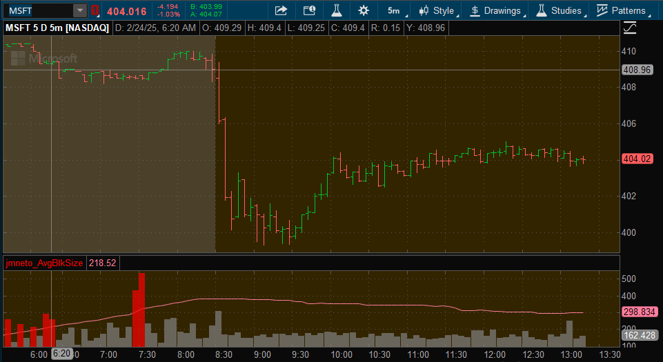

# ThinkScript Custom Chart Indicators

### Advancing/Decline Index (AD%)

- **Description:** Displays the Advancing/Declining Index (AD%) for various market sectors, providing a ratio of advancing to declining stocks. This script adds customizable labels to your ThinkorSwim chart, showing the AD% for the S&P (`SP`), Nasdaq (`NQ`), Russell (`RU`), and All Markets (`ALL`).

- **Purpose:** Helps traders assess the overall market breadth by comparing the number of advancing stocks to declining ones across different indices. A higher AD% indicates stronger market participation, while a lower AD% may signal weakening breadth and potential market reversals.

- **Usage:** Ideal for market analysts and traders looking to gauge the strength of market movements. By monitoring AD%, users can identify whether market trends are supported by broad-based participation or driven by a limited number of stocks, aiding in making informed trading decisions.

```
# Add labels with Advancing/Decline Index components ratio

# Symbols
input adv_symbol1 = "$ADVSP";
input decl_symbol1 = "$DECLSP";
input adv_symbol2 = "$ADVND";
input decl_symbol2 = "$DECLND";
input adv_symbol3 = "$ADVRL";
input decl_symbol3 = "$DECLRL";
input adv_symbol4 = "$ADVUS";
input decl_symbol4 = "$DECLUS";

# Calculate Value Function
script PrintAD {
    input _adv_symbol = "SPY";
    input _decl_symbol = "SPY";

    def adv = close(_adv_symbol);
    def decl = close(_decl_symbol);

    plot AD = Round(((adv - decl) / (adv + decl)) * 100, 0);
}

# Results
AddLabel(yes, "AD% ", Color.BLUE);
def C1 = PrintAD(adv_symbol1, decl_symbol1).AD;
AddLabel(yes, "SP " + C1, Color.GREEN);

def C2 = PrintAD(adv_symbol2, decl_symbol2).AD;
AddLabel(yes, "NQ " + C2, Color.DARK_ORANGE);

def C3 = PrintAD(adv_symbol3, decl_symbol3).AD;
AddLabel(yes, "RU " + C3, Color.DARK_RED);

def C4 = PrintAD(adv_symbol4, decl_symbol4).AD;
AddLabel(yes, "ALL " + C4, Color.WHITE);
```

### Advancing / Decline Index Components Volume Ratio

- **Description:**  
  This script calculates and plots the volume ratio of advancing to declining components for multiple market indices. By analyzing the balance between advancing and declining volumes, it provides a clear visual representation of market breadth and momentum across different sectors.

- **Purpose:**  
  The Advancing/Decline Index Components Volume Ratio helps traders assess the overall market strength and sentiment. By monitoring the volume ratios of various indices such as SP, NQ, RU, and ALL, traders can identify trends, confirm market direction, and spot potential reversals based on the underlying volume dynamics.

- **Usage:**  
  Ideal for technical analysts and traders who want to monitor market breadth indicators across multiple indices. This script is useful for:
  - Identifying the strength behind market moves.
  - Confirming trends by comparing volume ratios across different symbols.
  - Detecting divergences that may indicate potential market reversals.
  
  Suitable for use in the Thinkorswim platform as a lower study to complement other technical analysis tools.

```
# Advancing / Decline Index Components Volume Ratio

declare lower;

# Symbols
input adv_symbol1 = "$UVOLSP";
input decl_symbol1 = "$DVOLSP";
input adv_symbol2 = "$UVOLND";
input decl_symbol2 = "$DVOLND";
input adv_symbol3 = "$UVOLRL";
input decl_symbol3 = "$DVOLRL";
input adv_symbol4 = "$UVOLUS";
input decl_symbol4 = "$DVOLUS";

# Calculate Value Function
script PrintAD {
    input _adv_symbol = "SPY";
    input _decl_symbol = "SPY";

    def adv = close(_adv_symbol);
    def decl = close(_decl_symbol);

    plot AD = Round(((adv - decl) / (adv + decl)) * 100,  2);
}

# Plot Results
plot C1 = PrintAD(adv_symbol1, decl_symbol1).AD;
C1.SetDefaultColor(Color.CYAN);
C1.SetPaintingStrategy(PaintingStrategy.POINTS);
C1.SetLineWeight(1);
AddLabel(yes, "SP", C1.TakeValueColor());

plot C2 = PrintAD(adv_symbol2, decl_symbol2).AD;
C2.AssignValueColor(Color.DARK_ORANGE);
C2.SetPaintingStrategy(PaintingStrategy.POINTS);
C2.SetLineWeight(1);
AddLabel(yes, "NQ", C2.TakeValueColor());

plot C3 = PrintAD(adv_symbol3, decl_symbol3).AD;
C3.AssignValueColor(Color.DARK_RED);
C3.SetPaintingStrategy(PaintingStrategy.POINTS);
C3.SetLineWeight(1);
AddLabel(yes, "RU", C3.TakeValueColor());

plot C4 = PrintAD(adv_symbol4, decl_symbol4).AD;
C4.AssignValueColor(Color.WHITE);
C4.SetPaintingStrategy(PaintingStrategy.POINTS);
C4.SetLineWeight(1);
AddLabel(yes, "ALL", C4.TakeValueColor());
```

Example usage on Chart


### Big Blocks Indicator

- **Description:** Identifies and highlights significant trades by analyzing the ratio of volume to the number of trades.
- **Purpose:** Helps traders detect large trading activities, which may indicate strong market moves or significant interest in a particular security.
- **Usage:** Ideal for traders seeking to monitor and respond to substantial trading volumes in real-time, aiding in the identification of potential breakout or reversal points based on trade intensity.

```
# Find big trades (blocks) by comparing the ratio of volume divided by number of trades

plot Data = volume / tick_count;

plot threshold = 1.8 * average(Data, 50);

Data.AssignValueColor(if Data > threshold then Color.RED else Color.GRAY);
Data.HideTitle();
Data.SetPaintingStrategy(PaintingStrategy.SQUARED_HISTOGRAM);

Alert(Data[1] > threshold, AsText(close, NumberFormat.TWO_DECIMAL_PLACES), Alert.BAR, Sound.Ding);
```

Example usage on Chart




### Chart Labels: Change, Volume & Relative Volume

- **Description:**  
  Displays key metrics on the chart including the percentage change since the previous close, percentage change since the open, daily volume in millions, and relative volume compared to the average. Each label is color-coded to provide quick visual insights into market movements and trading activity.

- **Purpose:**  
  Provides traders with real-time, at-a-glance information directly on the chart, enabling quicker decision-making. By visualizing changes and volumes, traders can identify significant market shifts, high-volume activity, and relative trading strength without having to navigate away from the charting interface.

- **Usage:**  
  Ideal for active traders and day traders who require immediate access to critical market data. Helps in monitoring stock performance, assessing volatility, and evaluating trading volume trends to make informed entry and exit decisions.

```thinkscript
# Chart Labels: Change, Volume & Relative Volume
# Show labels in the Chart with Change since close, Change since Open, Volume and Relative Volume

declare upper;

def lastclose = close(Period = AggregationPeriod.DAY)[1];
def lastopen = open(Period = AggregationPeriod.DAY)[0];
def last = close()[0];

# Close Change
def cchg = last - lastclose;
AddLabel(!IsNaN(cchg), "C " + AsPercent(cchg / lastclose), 
    if cchg > 2 then Color.GREEN else
    if cchg >= 0 then Color.DARK_GREEN else
    if cchg < -2 then Color.RED else
    Color.DARK_RED);

# Open Change
def ochg = last - lastopen;
AddLabel(!IsNaN(ochg), "O " + AsPercent(ochg / lastopen), 
    if ochg > 2 then Color.GREEN else
    if ochg >= 0 then Color.DARK_GREEN else
    if ochg < -2 then Color.RED else
    Color.DARK_RED);

# Volume
def v = volume(Period = AggregationPeriod.DAY)[0];
AddLabel(yes, Round(v / 1000000, 1) + "M",
    if v > 10000000 then Color.BLUE else
    if v > 5000000 then Color.PLUM else 
    if v > 2000000 then Color.VIOLET else 
    Color.GRAY
);

# Relative Volume
def RelVol = Round(100 * (volume(Period = AggregationPeriod.DAY) / Average(volume(Period = AggregationPeriod.DAY))), 1);
AddLabel(!IsNaN(RelVol), "rv " + RelVol + "%", 
    if RelVol > 125 then CreateColor(171, 216, 255) else
    if RelVol > 100 then CreateColor(80, 173, 255) else
    if RelVol > 75  then CreateColor(10, 141, 255) else
    if RelVol > 50  then CreateColor(0, 104, 195) else
    CreateColor(0, 67, 125));
```

### Bars to Next Earnings

- **Description:** Displays the number of bars remaining until the next earnings report and provides information about past and upcoming earnings dates within a 30-day lookup period.
  
- **Purpose:** Assists traders in tracking upcoming earnings events and reviewing historical earnings data. This information is valuable for anticipating potential price movements and volatility associated with earnings announcements.

- **Usage:** Ideal for traders and investors who want to monitor earnings schedules directly within their ThinkOrSwim watchlists or charts. By knowing the proximity of earnings events, users can make more informed decisions regarding position sizing, entry and exit points, and risk management around earnings dates.

```
# Show information about past and future earnings dates

# Lookup period is 30 days forward and back

declare once_per_bar;
declare hide_on_intraday;

def LookupLength = 30;
def EventOffSet = GetEventOffset(Events.EARNINGS);
def HasEarnings = Sum(HasEarnings(type = EarningTime.ANY), LookupLength)[-LookupLength + 1] > 0;
def HasEarningsBefore = Sum(HasEarnings(type = EarningTime.BEFORE_MARKET), LookupLength)[-LookupLength + 1] > 0;

def PastEventOffSet = GetEventOffset(Events.EARNINGS, -1);
def HadEarnings = Sum(HasEarnings(type = EarningTime.ANY), LookupLength) > 0;
def HadEarningsBefore = Sum(HasEarnings(type = EarningTime.BEFORE_MARKET), LookupLength) > 0;

def a = if HasEarnings and HasEarningsBefore then EventOffSet 
        else if HasEarnings then EventOffSet - 0.5
        else if HadEarnings and HadEarningsBefore then PastEventOffSet + 1
        else if HadEarnings then PastEventOffSet - 0.5
        else 0;

AddLabel(yes, "E:" + a, if a < 0 then Color.RED else Color.BLACK);
```

### Imp Volatility

- **Description:** Displays the current Implied Volatility (IV) along with its ranking levels and range over a defined period.
- **Purpose:** Helps traders assess the relative level of implied volatility, identifying whether the current IV is low, medium, or high within the historical range. This aids in making informed decisions about option trading strategies based on volatility trends.
- **Usage:** Suitable for traders who utilize volatility as a key component in their trading strategies. By visualizing IV and its rankings, users can better gauge market sentiment and potential option price movements.

```
# Implied Volatility study showing the current IV and rank levels ranges

# Define declarations for the study
declare lower;
declare once_per_bar;
#declare hide_on_intraday;

# Clean IV data and define range (maxbars)
def maxBars = HighestAll(if IsNaN(close()) then 0 else BarNumber());
def ivClean = 100 * if IsNaN(imp_volatility())
    then if BarNumber() > maxBars then Double.NaN else ivClean[1]
    else imp_volatility();

# Max/low for the range
def ivHi = HighestAll(ivClean);        # highest IV over range
def ivLo = LowestAll(ivClean);         # lowest IV over range

# Print Ranges
plot p80 = (ivHi - ivLo) * 0.80 + ivLo;
p80.AssignValueColor(Color.PLUM);
p80.HideBubble();

plot p50 = (ivHi - ivLo) * 0.50 + ivLo;
p50.AssignValueColor(Color.PLUM);
p50.HideBubble();

plot p20 = (ivHi - ivLo) * 0.20 + ivLo;
p20.AssignValueColor(Color.PLUM);
p20.HideBubble();

# Print Natural IV
plot IV = ivClean;
IV.AssignValueColor(Color.GREEN);
IV.HideBubble();

# stats
def l1 = if ivClean <= p20 then l1[1] + 1 else l1[1];
def l2 = if ivClean > p20 and ivClean <= p50 then l2[1] + 1 else l2[1];
def l3 = if ivClean > p50 and ivClean <= p80 then l3[1] + 1 else l3[1];
def l4 = if ivClean > p80 then l4[1] + 1 else l4[1];

AddLabel(yes, "<20: " + AsPercent(l1 / (l1 + l2 + l3 + l4)), Color.WHITE);
AddLabel(yes, "21-50: " + AsPercent(l2 / (l1 + l2 + l3 + l4)), Color.WHITE);
AddLabel(yes, "51-80: " + AsPercent(l3 / (l1 + l2 + l3 + l4)), Color.WHITE);
AddLabel(yes, ">80: " + AsPercent(l4 / (l1 + l2 + l3 + l4)), Color.WHITE);
```

**Features:**

- **IV Calculation:** Computes the implied volatility and cleans the data to maintain accuracy.
- **Range Indicators:** Plots the 20%, 50%, and 80% levels within the historical IV range, colored in plum for easy visualization.
- **Current IV Display:** Shows the current IV in green, providing a clear indicator of the present volatility level.
- **Statistical Labels:** Adds labels that display the percentage of time IV has been within specific ranges (<20%, 21-50%, 51-80%, >80%), offering insight into volatility trends.


### Volatility Complete Study

- **Description:**  
  Displays implied volatility alongside historical volatility and range rank levels. This study visualizes how the current implied volatility compares to its historical values and ranks its position within a defined range.

- **Purpose:**  
  Provides traders with insights into volatility trends by comparing current implied volatility to historical data. Helps in identifying whether the current volatility is high, low, or average relative to its historical performance, aiding in informed trading decisions.

- **Usage:**  
  Ideal for traders and analysts who focus on volatility-based strategies. Useful for assessing the relative strength of implied volatility, determining potential entry and exit points based on volatility rankings, and managing risk by understanding volatility percentiles.

```
# Shows implied volatility as historical volatility and range rank levels

# Define declarations for the study
declare lower;
declare once_per_bar;

# Get data 
# For some futures, get the Vol directly from the index instead(improves data quality)
def ivDirty = Imp_volatility();

# Clean IV data and define range (maxbars)
def maxBars = HighestAll(if IsNaN(close()) then 0 else BarNumber());
def ivClean = if IsNaN(ivDirty)
    then If(BarNumber() > maxBars, Double.NaN, ivClean[1])
    else ivDirty;

# Defines IV Rank Calculation
def ivHi = HighestAll(ivClean);        # highest IV over range
def ivLo = LowestAll(ivClean);         # lowest IV over range
def ivRank =  (100 * (ivClean - ivLo)) / (ivHi - ivLo);  # IV rank
plot ivr = ivRank;
ivr.SetLineWeight(1);
ivr.HideBubble();
ivr.AssignValueColor(Color.BLUE);
AddLabel(yes, "Impl Vol Rank", Color.BLUE);

# Defines IV Percentile Calculation
def ivPercentileAux = fold idx1 = 1 to maxBars with s1 = 0 do if GetValue(ivClean, 0) > GetValue(ivClean, idx1) then s1 + 1 else s1;
def ivPercentile = (100 * ivPercentileAux) / maxBars;
plot ivp = ivPercentile;
ivp.SetLineWeight(1);
ivp.HideBubble();
ivp.AssignValueColor(Color.PLUM);
AddLabel(yes, "Impl Vol Percentile", Color.PLUM);

# Plot Marks
plot SeventyFiveMark = 75;
SeventyFiveMark.SetPaintingStrategy(PaintingStrategy.DASHES);
SeventyFiveMark.SetLineWeight(1);
SeventyFiveMark.HideBubble();
SeventyFiveMark.HideTitle();
SeventyFiveMark.AssignValueColor(Color.RED);

plot FiftyMark = 50;
FiftyMark.SetPaintingStrategy(PaintingStrategy.DASHES);
FiftyMark.SetLineWeight(1);
FiftyMark.HideBubble();
FiftyMark.HideTitle();
FiftyMark.AssignValueColor(Color.RED);

plot TwentyFiveMark = 25;
TwentyFiveMark.SetPaintingStrategy(PaintingStrategy.DASHES);
TwentyFiveMark.SetLineWeight(1);
TwentyFiveMark.HideBubble();
TwentyFiveMark.HideTitle();
TwentyFiveMark.AssignValueColor(Color.RED);
```

---

**Features:**

- **Implied Volatility (IV) Calculation:** Retrieves and cleans implied volatility data to ensure accuracy.
- **IV Rank:** Calculates the rank of current IV relative to its historical range, indicating where the current IV stands within the highest and lowest values.
- **IV Percentile:** Determines the percentile of current IV, showing the percentage of historical IV values that are lower than the current IV.
- **Visual Indicators:** Plots horizontal marks at 25, 50, and 75 percentiles to aid in quick visual assessment of volatility levels.
- **Customizable Labels and Colors:** Adds labels for easy identification and uses color-coding to represent different volatility levels clearly.

Example usage on Chart


### Volume Profile

- **Description:** Visualizes the volume distribution of a security throughout the trading day, automatically initiating profiles at market open and close.
- **Purpose:** Helps traders analyze where the majority of trading volume occurs, identifying key price levels of interest and potential support or resistance areas based on volume concentration.
- **Usage:** Ideal for intraday traders and analysts looking to understand volume dynamics during specific trading sessions, enhancing decision-making for entries, exits, and risk management by highlighting significant volume clusters.

```
#
# Volume Profile with automatic profile start at market open/closes
# Show the volume profile intraday starting the collection at specified times
# Show only on intraday, simplified version, selectable color scheme
# Automatically starts new profile on market open/close

declare hide_on_daily;
declare once_per_bar;

# Profile control parameters
input profiles = 10;
input valueAreaPercent = 70;
input colorScheme = {Purple, default Green, Pink, Blue, Orange, Maroon};
input opacity = 10;

# Define if new profile is needed
input Profile1StartTime = 0930;
input Profile2StartTime = 1600;
# Find bar for specified timeframes
def startProfile1 = SecondsFromTime(Profile1StartTime) == if Profile1StartTime == 1700 then 3600 else 0 and !IsNaN(close());  # Tos bug
def startProfile2 = SecondsFromTime(Profile2StartTime) == if Profile2StartTime == 1700 then 3600 else 0 and !IsNaN(close());  # Tos bug
# Define if we need to start a new profile
def startNewProfile = (startProfile1 == 1 and startProfile1[0] <> startProfile1[1]) or (startProfile2 == 1 and startProfile2[0] <> startProfile2[1]);

# Define profile color
def profColor;
switch (colorScheme)
{
case Purple:
    profColor = 0;
case Green:
    profColor = 1;
case Pink:
    profColor = 2;
case Blue:
    profColor = 3;
case Orange:
    profColor = 4;
case Maroon:
    profColor = 5;
}
DefineGlobalColor("Profile", GetColor(profColor));

# Print profile
profile vol = VolumeProfile("startNewProfile" = startNewProfile, "onExpansion" = no, "numberOfProfiles" = profiles, "pricePerRow" = PricePerRow.TICKSIZE, "value area percent" = valueAreaPercent);
vol.Show(GlobalColor("Profile"), Color.CURRENT, Color.CURRENT, opacity);
```

Example usage on Chart


### Intraday PIVOTS

- **Description:** Plots key pivot lines including the previous day's high and low, current day's high and low, and Regular Trading Hours (RTH) open and close prices on intraday charts.
- **Purpose:** Helps traders identify critical support and resistance levels throughout the trading day by visualizing important price points. This facilitates better decision-making for entry and exit points during intraday trading.
- **Usage:** Ideal for intraday traders using the thinkorswim platform who seek to monitor essential pivot levels in real-time. The script automatically updates pivot lines based on daily and RTH data, providing a clear visual reference for market conditions.

```thinkscript
# intraday PIVOTS

# Show the Pivot Lines for various datapoints as described in the notes below
# Feb 2016

declare hide_on_daily;
declare once_per_bar;

# Check assertions for the study
Assert(GetAggregationPeriod() <= AggregationPeriod.DAY, "Study can be calculated only for daily periods or less");

# Find the max bar
def maxBars = 0 + HighestAll(if IsNaN(close()) then 0 else BarNumber());

# Previous Day High and Low
plot PlotPH = if BarNumber() > maxBars then high(period = AggregationPeriod.DAY)[1] else Double.NaN;
PlotPH.SetPaintingStrategy(paintingStrategy.DASHES);
PlotPH.AssignValueColor(Color.BLUE);
PlotPH.HideTitle();
PlotPH.HideBubble();
PlotPH.SetLineWeight(2);

plot PlotPL = if BarNumber() > maxBars then low(period = AggregationPeriod.DAY)[1] else Double.NaN;
PlotPL.SetPaintingStrategy(paintingStrategy.DASHES );
PlotPL.AssignValueColor(Color.BLUE);
PlotPL.HideTitle();
PlotPL.HideBubble();
PlotPL.SetLineWeight(2);

# Current Day High/Low
plot PlotCHIGH = if BarNumber() > maxBars then high(period = AggregationPeriod.DAY)[0] else Double.NaN;
PlotCHIGH.SetPaintingStrategy(PaintingStrategy.DASHES);
PlotCHIGH.AssignValueColor(Color.YELLOW );
PlotCHIGH.HideTitle();
PlotCHIGH.HideBubble();
PlotCHIGH.SetLineWeight(2);

plot PlotCLOW = if BarNumber() > maxBars then low(period = AggregationPeriod.DAY)[0] else Double.NaN;
PlotCLOW.SetPaintingStrategy(PaintingStrategy.DASHES);
PlotCLOW.AssignValueColor(Color.YELLOW );
PlotCLOW.HideTitle();
PlotCLOW.HideBubble();
PlotCLOW.SetLineWeight(2);

# Regular Trade Open/Close hours
input RTHOpenTime = 0930;
input RTHCloseTime = 1600;

# Plot RTH Close Price on expansion area
def cl = if SecondsFromTime(RTHCloseTime) == 0 and !IsNaN(close()[1]) then close()[1] else if cl[1] > 0 then cl[1] else Double.NaN;
plot PlotCl = if BarNumber() > maxBars  then cl else Double.NaN;
PlotCl.SetPaintingStrategy(PaintingStrategy.DASHES );
PlotCl.AssignValueColor(Color.DARK_GREEN);
PlotCl.HideTitle();
PlotCl.HideBubble();
PlotCl.SetLineWeight(2);

# Plot RTH Open Price on expansion area
def op = if SecondsFromTime(RTHOpenTime) == 0 and !IsNaN(open()) then open() else if op[1] > 0 then op[1] else Double.NaN;
plot PlotOp = if BarNumber() > maxBars then op else Double.NaN;
PlotOp.SetPaintingStrategy(PaintingStrategy.DASHES);
PlotOp.AssignValueColor(Color.RED);
PlotOp.HideTitle();
PlotOp.HideBubble();
PlotOp.SetLineWeight(2);

# Open Close RTH Vertical marks
AddVerticalLine(SecondsFromTime(RTHOpenTime) == 0 and !IsNaN(close()), "Open", Color.DARK_RED );
AddVerticalLine(SecondsFromTime(RTHCloseTime) == 0 and !IsNaN(close()), "Close", Color.DARK_GREEN );
```
Example usage on Chart


### Week Expected Move (1σ)

- **Description:** Calculates the one standard deviation (1σ) expected price move for the week based on the previous Friday's closing price and the implied volatility.
- **Purpose:** Helps traders anticipate the potential price range for the upcoming week by providing upper and lower bounds derived from historical volatility data. This assists in making informed trading decisions regarding entry and exit points.
- **Usage:** Ideal for swing traders and options traders who want to understand the expected price movement within the week. By visualizing the expected range, traders can better manage risk and identify potential breakout or reversal opportunities.

```
# Calculates 1σ for the week from last Friday Close

declare once_per_bar;

def days = 5;
def stddev = 1;

# Check assertions for the study
Assert(GetAggregationPeriod() <= AggregationPeriod.DAY, "Study can be calculated only for daily periods or less");

def maxBars = HighestAll(if IsNaN(close()) then 0 else BarNumber());

def ivClean =
    if IsNaN(imp_volatility(period = AggregationPeriod.DAY))
    then 
        ivClean[1]
    else 
        imp_volatility(period = AggregationPeriod.DAY) ;

def price =    
    if (IsNaN(open(period = AggregationPeriod.DAY))) 
    then 
        price[1] 
    else 
        open(period = AggregationPeriod.DAY );

def yyyyMmDd = GetYYYYMMDD();
def isPeriodRolled = GetDayOfWeek(yyyyMmDd) == 1 && BarNumber() <= maxBars ; #Monday

def ivExpRange;
def up;
def down;

if (isPeriodRolled) {
    ivExpRange = price[0] * ivClean[0] * Sqrt(days / 365) * stddev;
    up = price[0] + ivExpRange;
    down = price[0] - ivExpRange;
}
else
{
    ivExpRange = ivExpRange[1];
    up = up[1];
    down = down[1];
}

plot UpSd =  up;
UpSd.SetPaintingStrategy(PaintingStrategy.HORIZONTAL);
UpSd.SetLineWeight(1);
UpSd.AssignValueColor(Color.PLUM);
UpSd.HideBubble();
UpSd.HideTitle();

plot DownSd = down;
DownSd.SetPaintingStrategy(PaintingStrategy.HORIZONTAL);
DownSd.SetLineWeight(1);
DownSd.AssignValueColor(Color.PLUM);
DownSd.HideBubble();
DownSd.HideTitle();
```

Example usage on Chart


### Day Expected Move

- **Description:** Calculates and visualizes the expected daily price range based on implied volatility and the remaining trading time until the market close. This script generates upper and lower bounds representing potential price movements for the trading day.

- **Purpose:** Assists traders in identifying potential support and resistance levels by providing an estimated range within which the stock price is likely to move. This helps in making informed trading decisions, managing risk, and setting appropriate entry and exit points.

- **Usage:** Ideal for day traders and intraday traders who want to gauge the potential volatility and price range for the trading day. By understanding the expected move, traders can better plan their strategies, set stop-loss levels, and identify possible breakout or reversal scenarios.

```thinkscript
# Day Expected Move

declare hide_on_daily;

# Get data 
def iv = imp_volatility();
input RTHCloseTime = 1600;
def price = close();

# Parameters for expected move
def minutetoend = SecondsTillTime(RTHCloseTime) / 60;
def min_1 = 362880; #252 * 1440;
def min_5 = 72576;  #252 * 288;
def min_15 = 24192; #252 * 96;
def min_30 = 12096; #252 * 48;

def min = if (GetAggregationPeriod() <= AggregationPeriod.MIN) then min_1 
         else if (GetAggregationPeriod() <= AggregationPeriod.FIVE_MIN) then min_5
         else if (GetAggregationPeriod() <= AggregationPeriod.FIFTEEN_MIN) then min_15
         else if (GetAggregationPeriod() <= AggregationPeriod.THIRTY_MIN) then min_30
         else 1 / 0;

def minend = if (GetAggregationPeriod() <= AggregationPeriod.MIN) then minutetoend
            else if (GetAggregationPeriod() <= AggregationPeriod.FIVE_MIN) then minutetoend / 5
            else if (GetAggregationPeriod() <= AggregationPeriod.FIFTEEN_MIN) then minutetoend / 15
            else if (GetAggregationPeriod() <= AggregationPeriod.THIRTY_MIN) then minutetoend / 30
            else 1 / 0;

def expRange = price * iv * Sqrt(minend / min);

def up = price + expRange;
def down = price - expRange;

plot UpSd = up;
UpSd.SetPaintingStrategy(PaintingStrategy.LINE);
UpSd.SetLineWeight(1);
UpSd.SetDefaultColor(Color.GRAY);
UpSd.HideTitle();
UpSd.HideBubble();

plot DownSd = down;
DownSd.SetPaintingStrategy(PaintingStrategy.LINE);
DownSd.SetLineWeight(1);
DownSd.SetDefaultColor(Color.GRAY);
DownSd.HideTitle();
DownSd.HideBubble();
```

Example usage on Chart


