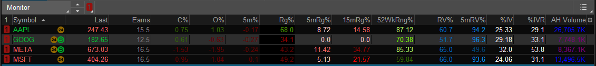
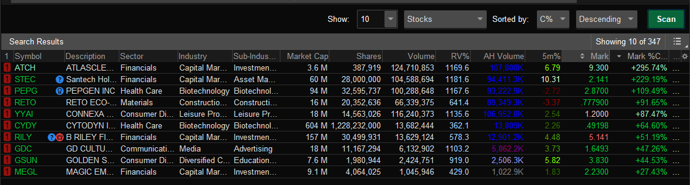
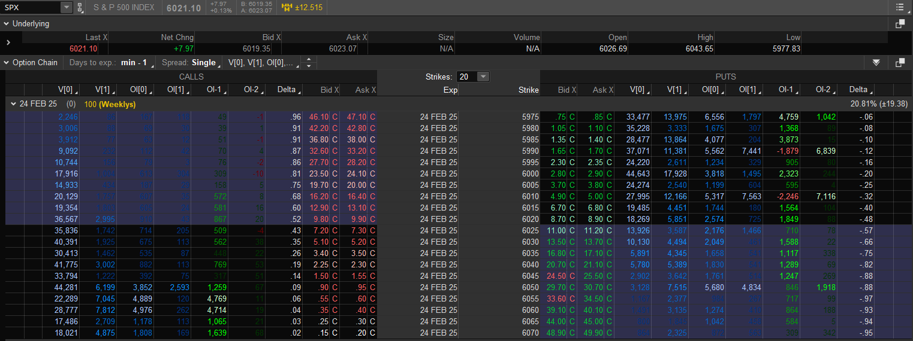

# ThinkScript Custom Columns

## MarketWatch and Scanner Columns

Example usage on MarketWatch



Example usage on Scanner




### Implied Volatility Percent

- **Description:** Displays the current Implied Volatility (IV) as a percentage.
- **Purpose:** Helps assess the market's expectation of future volatility for a particular security.
- **Usage:** Useful for options traders to evaluate the relative cost of options premiums.

```
# Watchlist column showing the current Implied Volatility
# TOS Column Timeframe Configuration: Daily

# Get data 
def vol = imp_volatility(period = AggregationPeriod.DAY);

# Plot IV
plot IV = Round(vol * 100, 2);
IV.AssignValueColor(Color.WHITE);
```

### Implied Volatility Rank

- **Description:** Shows the current IV Rank, indicating where the current IV stands relative to its historical range over the past 252 trading days.
- **Purpose:** Assists in determining whether the IV is high or low compared to historical levels.
- **Usage:** Enables traders to identify optimal times for buying or selling options based on volatility levels.

```
# Watchlist column showing the current Implied Volatility Rank
# TOS Column Timeframe Configuration: Daily

# Get data 
def vol = imp_volatility(period = AggregationPeriod.DAY);

# IV Rank Calculation
def ivHi = Highest(vol, 252);        # highest IV over range
def ivLo = Lowest(vol, 252);         # lowest IV over range
plot IVR = Round((100 * (vol - ivLo)) / (ivHi - ivLo), 1);
IVR.AssignValueColor (if IVR < 20 then Color.RED else if IVR > 80 then Color.GREEN else Color.WHITE);
```

### 5-Minute Price Range

- **Description:** Shows the price movement range over the last 5 minutes as a percentage.
- **Purpose:** Offers an even more granular view of price changes for short-term trading strategies.
- **Usage:** Suitable for scalpers and high-frequency traders monitoring rapid price movements.

```
# Watchlist column showing 5 minute price Relative Range
# TOS Column Timeframe Configuration: 1 Minute include Extended-Hours Trading Session

def length = 5;

# Calculate Rank
def Hi = Highest(high, length) ;        # highest over range
def Lo = Lowest(low, length) ;         # lowest over range
plot output =  (100 * (close - Lo)) / (Hi - Lo);  # rank;

output.AssignValueColor(
    if output > 90 then CreateColor(229, 255, 204) else
    if output > 80 then CreateColor(178, 255, 102) else
    if output > 70  then CreateColor(128, 255, 0) else
    if output > 60  then CreateColor(73, 153, 0) else
    if output > 50  then CreateColor(51, 102, 0) else
    if output > 40 then CreateColor(102, 0, 0) else
    if output > 30  then CreateColor(153, 0, 0) else
    if output > 20  then CreateColor(255, 0, 0) else
    if output > 10 then CreateColor(255, 102, 102) else
    CreateColor(255, 204, 204)
);
```

### 15-Minute Price Range

- **Description:** Reflects the price movement range over the last 15 minutes as a percentage.
- **Purpose:** Provides a short-term view of price fluctuations to identify potential breakout or reversal points.
- **Usage:** Ideal for day traders seeking intraday trading opportunities.

```
# Watchlist column 15 minutes Price Range
# TOS Column Timeframe Configuration: 1 Minute include Extended-Hours Trading Session

def length = 15;

# Calculate Rank
def Hi = Highest(high, length) ;        # highest over range
def Lo = Lowest(low, length) ;         # lowest over range
plot output =  (100 * (close - Lo)) / (Hi - Lo);  # rank;

output.AssignValueColor(
    if output > 90 then CreateColor(229, 255, 204) else
    if output > 80 then CreateColor(178, 255, 102) else
    if output > 70  then CreateColor(128, 255, 0) else
    if output > 60  then CreateColor(73, 153, 0) else
    if output > 50  then CreateColor(51, 102, 0) else
    if output > 40 then CreateColor(102, 0, 0) else
    if output > 30  then CreateColor(153, 0, 0) else
    if output > 20  then CreateColor(255, 0, 0) else
    if output > 10 then CreateColor(255, 102, 102) else
    CreateColor(255, 204, 204)
);
```

### 52-Week Price Range

- **Description:** Displays the current price position within the 52-week high and low range as a percentage.
- **Purpose:** Offers a long-term perspective on a security's price performance.
- **Usage:** Helps investors identify stocks that are nearing their yearly highs or lows, indicating potential momentum shifts.

```
# Watchlist column showing the current Price as a range relative to the last 52 Weeks
# TOS Column Timeframe Configuration: Daily

declare once_per_bar;
def length = 364;

# Calculate Rank
def Hi = Highest(high, length) ;        # highest over range
def Lo = Lowest(low, length) ;         # lowest over range
plot output =  (100 * (close - Lo)) / (Hi - Lo);  # rank;

output.AssignValueColor(
    if output > 90 then CreateColor(229, 255, 204) else
    if output > 80 then CreateColor(178, 255, 102) else
    if output > 70  then CreateColor(128, 255, 0) else
    if output > 60  then CreateColor(73, 153, 0) else
    if output > 50  then CreateColor(51, 102, 0) else
    if output > 40 then CreateColor(102, 0, 0) else
    if output > 30  then CreateColor(153, 0, 0) else
    if output > 20  then CreateColor(255, 0, 0) else
    if output > 10 then CreateColor(255, 102, 102) else
    CreateColor(255, 204, 204)
);
```

### After Hours Volume

- **Description:** Displays the trading volume that occurs after regular market hours.
- **Purpose:** Provides insights into trading activity outside of standard trading sessions, which can influence overnight price movements.
- **Usage:** Essential for traders who engage in after-hours trading or who want to understand the broader market sentiment.

```
# Watchlist column showing AH Volume
# TOS Column Timeframe Configuration: 1 Minute include Extended-Hours Trading Session

def closing_bell = SecondsTillTime(1559) == 0;

rec ah_volume = CompoundValue(1, if closing_bell then volume else ah_volume[1] + volume, volume);

plot v = ah_volume;

AddLabel(yes, Round(v / 1000, 1) + "K",
    if v > 10000000 then Color.BLUE else
    if v > 5000000 then Color.PLUM else 
    if v > 2000000 then Color.VIOLET else 
    Color.GRAY
);
```

### 5-Minute Price Change

- **Description:** Displays the current price change percentage over the last 5 minutes.
- **Purpose:** Provides a short-term view of price movements, allowing traders to quickly assess recent market activity.
- **Usage:** Ideal for day traders and scalpers who need to monitor rapid price changes to make timely trading decisions.

```
# Watchlist column showing the current price change percentual in the last 5 minutes
# TOS Column Timeframe Configuration: 5 Minute include Extended-Hours Trading Session

def base = if close[0] > hl2[1] then low[1] else high[1];

def percchange = (100 * ((close - base) / base));

plot output = Round(percchange, 2);

output.AssignValueColor(
    if output > 10 then CreateColor(229, 255, 204) else
    if output > 7 then CreateColor(178, 255, 102) else
    if output > 5  then CreateColor(128, 255, 0) else
    if output > 3  then CreateColor(73, 153, 0) else
    if output > 0  then CreateColor(51, 102, 0) else
    if output > -3 then CreateColor(102, 0, 0) else
    if output > -5  then CreateColor(153, 0, 0) else
    if output > -7  then CreateColor(255, 0, 0) else
    if output > -10 then CreateColor(255, 102, 102) else
    CreateColor(255, 204, 204)
);
```

### Percent Change Since Last Close (C%)

- **Description:** Shows the current percent change since the last market close, including after-hours (AH) trading.
- **Purpose:** Provides a comprehensive view of a stock's performance relative to its previous closing price, factoring in after-hours movements.
- **Usage:** Useful for investors who want to monitor overnight news impacts or after-hours trading activity on their watchlist.

```
# Watchlist column showing the current percent change since last close (includes AH)
# TOS Column Timeframe Configuration: 1 Minute include Extended-Hours Trading Session

def closing_bell = SecondsTillTime(1559) == 0;

rec closing_price = CompoundValue(1, if closing_bell then close else closing_price[1], close);

plot output = Round(100 * (close / closing_price - 1), 2);

output.AssignValueColor(
    if output > 10 then CreateColor(229, 255, 204) else
    if output > 7 then CreateColor(178, 255, 102) else
    if output > 5  then CreateColor(128, 255, 0) else
    if output > 3  then CreateColor(73, 153, 0) else
    if output > 0  then CreateColor(51, 102, 0) else
    if output > -3 then CreateColor(102, 0, 0) else
    if output > -5  then CreateColor(153, 0, 0) else
    if output > -7  then CreateColor(255, 0, 0) else
    if output > -10 then CreateColor(255, 102, 102) else
    CreateColor(255, 204, 204)
);
```

### Percent Change Since Open (O%)

- **Description:** Displays the current percent change since the market open.
- **Purpose:** Offers a real-time perspective on how a stock is performing relative to its opening price.
- **Usage:** Ideal for intraday traders looking to assess the strength or weakness of a stock's current trading session.

```
# Watchlist column showing the current percent change since last open
# TOS Column Timeframe Configuration: Daily

plot output = Round(100 * ((close - open) / open), 2);

output.AssignValueColor(
    if output > 10 then CreateColor(229, 255, 204) else
    if output > 7 then CreateColor(178, 255, 102) else
    if output > 5  then CreateColor(128, 255, 0) else
    if output > 3  then CreateColor(73, 153, 0) else
    if output > 0  then CreateColor(51, 102, 0) else
    if output > -3 then CreateColor(102, 0, 0) else
    if output > -5  then CreateColor(153, 0, 0) else
    if output > -7  then CreateColor(255, 0, 0) else
    if output > -10 then CreateColor(255, 102, 102) else
    CreateColor(255, 204, 204)
);
```

### Earnings Day Count

- **Description:** Displays the number of bars until the next scheduled earnings report or since the last earnings report.
- **Purpose:** Helps traders keep track of upcoming earnings announcements, which can significantly impact stock prices.
- **Usage:** Useful for traders who base strategies on earnings reports, such as buying ahead of positive earnings or avoiding potential volatility.

```
# Watchlist column showing the number of bars to next/previous earnings
# TOS Column Timeframe Configuration: Daily

# Lookup period is 30 days forward and back

declare once_per_bar;

def LookupLength = 30;
def EventOffSet = GetEventOffset(Events.EARNINGS);
def HasEarnings = Sum(HasEarnings(type = EarningTime.ANY), LookupLength)[-LookupLength + 1] > 0;
def HasEarningsBefore = Sum(HasEarnings(type = EarningTime.BEFORE_MARKET), LookupLength)[-LookupLength + 1] > 0;

def PastEventOffSet = GetEventOffset(Events.EARNINGS, -1);
def HadEarnings = Sum(HasEarnings(type = EarningTime.ANY), LookupLength) > 0;
def HadEarningsBefore = Sum(HasEarnings(type = EarningTime.BEFORE_MARKET), LookupLength) > 0;

plot a = if HasEarnings and HasEarningsBefore then EventOffSet 
         else if HasEarnings then EventOffSet - 0.5
         else if HadEarnings and HadEarningsBefore then PastEventOffSet + 1
         else if HadEarnings then PastEventOffSet - 0.5
         else 0;

a.AssignValueColor(
    if a < -1.6 then Color.PLUM else 
    if a < 0 then Color.BLUE else
    Color.GRAY
);
```

### Relative Volume (RV%)

- **Description:** Shows the current trading volume as a percentage relative to the stock's average volume.
- **Purpose:** Indicates the intensity of trading activity, highlighting unusual volume spikes that may signal significant market interest or potential price movements.
- **Usage:** Useful for identifying stocks with abnormal trading activity, which can precede price breakouts or trend reversals.

```
# Watchlist column showing Relative Volume
# TOS Column Timeframe Configuration: Daily

plot RelVol = Round(100 * (volume / Average(volume)), 1);

RelVol.AssignValueColor(
    if RelVol > 125 then CreateColor(171, 216, 255) else
    if RelVol > 100 then CreateColor(80, 173, 255) else
    if RelVol > 75  then CreateColor(10, 141, 255) else
    if RelVol > 50  then CreateColor(0, 104, 195) else
    CreateColor(0, 67, 125)
);
```

### 5-Minute Relative Volume %

- **Description:** Indicates the relative volume over the past 5 minutes compared to the stock's average volume.
- **Purpose:** Measures the intensity of trading activity, highlighting unusual volume spikes.
- **Usage:** Useful for identifying significant market interest or potential catalysts driving price movement.

```
# Watchlist column showing Relative Volume in the last 5 minutes
# TOS Column Timeframe Configuration: 5 Minute include Extended-Hours Trading Session

plot RelVol = Round(100 * (volume / Average(volume)), 1);

RelVol.AssignValueColor(
    if RelVol > 125 then CreateColor(171, 216, 255) else
    if RelVol > 100 then CreateColor(80, 173, 255) else
    if RelVol > 75  then CreateColor(10, 141, 255) else
    if RelVol > 50  then CreateColor(0, 104, 195) else
    CreateColor( 0, 67, 125)
);
```

### Daily Range (Rg%)

- **Description:** Displays the current price as a percentage of the daily price range.
- **Purpose:** Provides insight into where the current price stands within the day's high and low, helping traders identify potential support and resistance levels.
- **Usage:** Ideal for intraday traders looking to gauge momentum and potential breakout or reversal points based on the stock's relative position within the daily range.

```
# Watchlist column showing current price as a percentage of the Daily price range 
# TOS Column Timeframe Configuration: Daily

# Calculate Rank
plot output = Round(100 * (close[0] - low[0]) / (high[0] - low[0]), 1);

output.AssignValueColor(
    if output > 90 then CreateColor(229, 255, 204) else
    if output > 80 then CreateColor(178, 255, 102) else
    if output > 70  then CreateColor(128, 255, 0) else
    if output > 60  then CreateColor(73, 153, 0) else
    if output > 50  then CreateColor(51, 102, 0) else
    if output > 40 then CreateColor(102, 0, 0) else
    if output > 30  then CreateColor(153, 0, 0) else
    if output > 20  then CreateColor(255, 0, 0) else
    if output > 10 then CreateColor(255, 102, 102) else
    CreateColor(255, 204, 204)
);

AssignBackgroundColor(
    if close >= high then Color.LIME 
    else if close <= low then Color.DARK_ORANGE 
    else Color.BLACK
);
```

## Option Chain Columns

Example usage on Options Chain



### Open Interest Difference (1 Day Ago) 

- **Description:** Displays the difference in open interest compared to 1 day ago.
- **Purpose:** Helps traders monitor changes in open interest on a daily basis, which can indicate market sentiment and potential price movements.
- **Usage:** Useful for identifying increasing or decreasing interest in a particular security, aiding in decision-making for entering or exiting trades.

```
# Watchlist column showing the current open interest difference from 1 day ago
# TOS Column Timeframe Configuration: Daily

def a = open_interest[0] - open_interest[1];
AddLabel(yes, a,
    if a > 4000 then CreateColor(200, 255, 200) else
    if a > 2000 then CreateColor(100, 255, 100) else
    if a > 1000 then CreateColor(0, 255, 0) else
    if a > 500 then CreateColor(0, 150, 0) else
    if a < -1000 then CreateColor(255, 100, 100) else
    if a < -500 then CreateColor(255, 50, 50) else
    if a < -250 then CreateColor(200, 0, 0) else
    if a < 0 then CreateColor(100, 0, 0) else
    CreateColor(0, 50, 0));
```

### Open Interest Difference (2 Days Ago) 

- **Description:** Displays the difference in open interest compared to 2 days ago.
- **Purpose:** Provides a short-term view of changes in open interest, offering insights into recent trading activity and potential trends.
- **Usage:** Assists traders in identifying rapid changes in market interest, which may precede significant price movements.

```
# Watchlist column showing the current open interest difference from 2 days ago
# TOS Column Timeframe Configuration: Daily

def a = open_interest[1] - open_interest[2];
AddLabel(yes, a,
    if a > 4000 then CreateColor(200, 255, 200) else
    if a > 2000 then CreateColor(100, 255, 100) else
    if a > 1000 then CreateColor(0, 255, 0) else
    if a > 500 then CreateColor(0, 150, 0) else
    if a < -1000 then CreateColor(255, 100, 100) else
    if a < -500 then CreateColor(255, 50, 50) else
    if a < -250 then CreateColor(200, 0, 0) else
    if a < 0 then CreateColor(100, 0, 0) else
    CreateColor(0, 50, 0));
```

### Current Open Interest 

- **Description:** Displays the current open interest.
- **Purpose:** Provides traders with real-time data on the number of outstanding contracts, offering insights into market liquidity and trader sentiment.
- **Usage:** Essential for assessing the strength of a price trend; high open interest indicates strong participation, while low open interest may suggest a lack of conviction.

```
# Watchlist column showing the current open interest
# TOS Column Timeframe Configuration: Daily

def a = open_interest[0];
AddLabel(yes, a,
    if a > 4000 then CreateColor(170, 200, 255) else
    if a > 3000 then CreateColor(80, 170, 255) else
    if a > 2000 then CreateColor(10, 140, 255) else
    if a > 1000 then CreateColor(0, 100, 200) else
    CreateColor(0, 50, 125));
```

### Yesterday's Open Interest 

- **Description:** Displays yesterday's open interest.
- **Purpose:** Provides a reference point for comparing current open interest, helping to identify trends and shifts in market activity.
- **Usage:** Useful for analyzing changes in trader positions and gauging market momentum over a short period.

```
# Watchlist column showing the Yesterday's open interest
# TOS Column Timeframe Configuration: Daily

def a = open_interest[1];
AddLabel(yes, a,
    if a > 4000 then CreateColor(170, 200, 255) else
    if a > 3000 then CreateColor(80, 170, 255) else
    if a > 2000 then CreateColor(10, 140, 255) else
    if a > 1000 then CreateColor(0, 100, 200) else
    CreateColor(0, 50, 125));
```

### Current Volume 

- **Description:** Displays the current trading volume.
- **Purpose:** Indicates the number of shares or contracts traded, providing insights into the strength and sustainability of price movements.
- **Usage:** High volume often confirms trends, while low volume may suggest a lack of interest or potential reversal points.

```
# Watchlist column showing the current Volume
# TOS Column Timeframe Configuration: Daily

def a = volume[0];
AddLabel(yes, a,
    if a > 16000 then CreateColor(170, 200, 255) else
    if a > 8000 then CreateColor(80, 170, 255) else
    if a > 4000 then CreateColor(10, 140, 255) else
    if a > 2000 then CreateColor(0, 100, 200) else
    CreateColor(0, 50, 125));
```

### Yesterday's Volume 

- **Description:** Displays yesterday's trading volume.
- **Purpose:** Serves as a benchmark to compare current volume, aiding in the assessment of current trading activity relative to the previous day.
- **Usage:** Helps identify unusual spikes or drops in volume, which may signal significant market events or shifts in trader behavior.

```
# Watchlist column showing the Yesterday's Volume
# TOS Column Timeframe Configuration: Daily

def a = volume[1];
AddLabel(yes, a,
    if a > 16000 then CreateColor(170, 200, 255) else
    if a > 8000 then CreateColor(80, 170, 255) else
    if a > 4000 then CreateColor(10, 140, 255) else
    if a > 2000 then CreateColor(0, 100, 200) else
    CreateColor(0, 50, 125));
```
