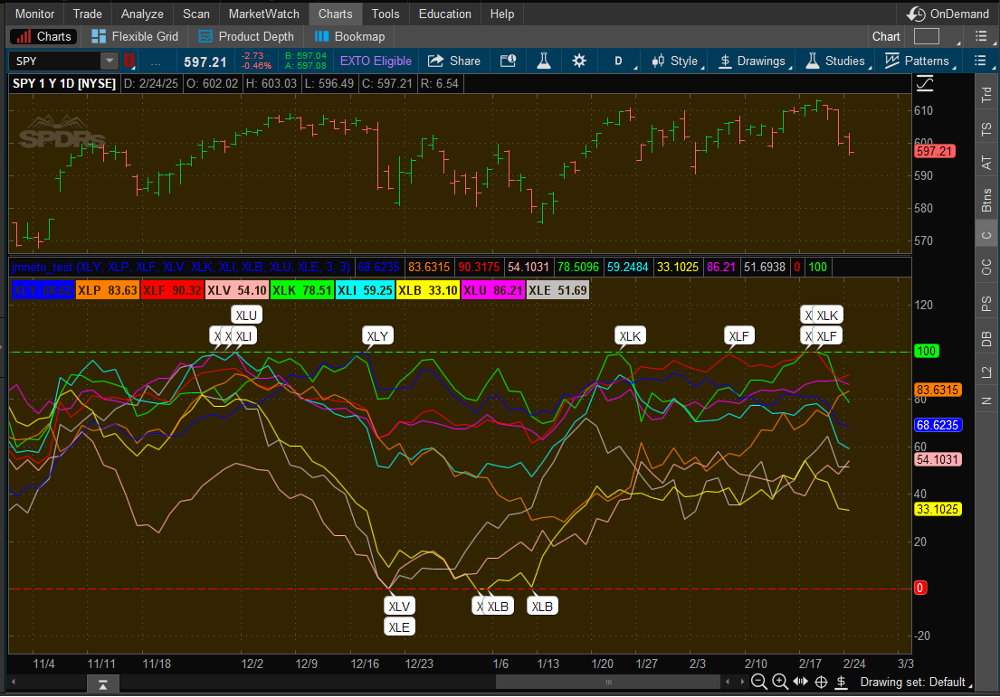

<h1 align="center">
  Custom thinkorswim thinkScript Chart Indicators &  MarketWatch / Scanner Columns
</h1>

  
  

This project contains a collection of custom thinkorswim thinkScript indicators and columns.

- [**Charts (Indicators)**](./Chart-Scripts.md)  
- [**Columns (MarketWatch or Scanner)**](./Column-Scrits.md) 
- [**Advanced Scripts**](./Advanced-Scripts.md)

---
thinkScript® is a [thinkorswim](https://toslc.thinkorswim.com/center) built-in programming language that gives you the capability of creating your own analysis tools such as studies, strategies, watchlist columns, etc.

